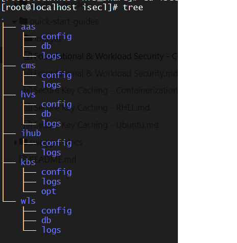
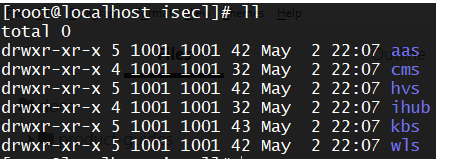

# Intel® Security Libraries Container Deployment 

## Prerequisites for Containerized Deployment using Kubernetes 

### Supported Operating Systems

- RHEL 8.3
- Ubuntu 18.04

### Kubernetes Distributions

The included Intel SecL container deployment scripts can deploy using the following Kubernetes distributions:

- Single-node: `microk8s` (1.17.17)
  - A "single-node" deployment will deploy all of the Intel SecL services into a single microk8s deployment on a single **bare metal** container host.   Because all resources are deployed onto a single worker, only local resources are required.  This deployment type is best used for POCs and demos due to the requirement of a physical server.
- Multi-node: `kubeadm` (1.17.17)
  - A "multi-node" deployment will deploy the Intel SecL services using kubeadm as a Kubernetes pod, using NFS shared storage.  Any worker nodes that will be attested must be bare metal physical servers; agents will be deployed as privileged DaemonSets.

### Container Runtime

- CRIO-1.17.5 on RHEL 8.3
- CRIO-1.17.5 on Ubuntu 18.04

### Storage

- Single-node:`hostPath` storage for all services and agents
- Multi-node:`NFS` storage for all services, `hostPath ` storage for agents


## Building from Source

###  Prerequisites

The following steps need to be performed on a RHEL 8.3 Build machine (VM/Physical Node)

####  System Tools and Utilities

```shell
# RedHat Enterprise Linux 8.3
dnf install -y git wget tar python3 gcc gcc-c++ zip make yum-utils openssl-devel
dnf install -y https://dl.fedoraproject.org/pub/fedora/linux/releases/32/Everything/x86_64/os/Packages/m/makeself-2.4.0-5.fc32.noarch.rpm
ln -s /usr/bin/python3 /usr/bin/python
ln -s /usr/bin/pip3 /usr/bin/pip

# Ubuntu-18.04
apt update
apt remove -y gcc gcc-7
apt install -y python3-problem-report git wget tar python3 gcc-8 make makeself openssl libssl-dev libgpg-error-dev
cp /usr/bin/gcc-8 /usr/bin/gcc
ln -s /usr/bin/python3 /usr/bin/python
ln -s /usr/bin/pip3 /usr/bin/pip
```

####  Repo tool

```shell
tmpdir=$(mktemp -d)
git clone https://gerrit.googlesource.com/git-repo $tmpdir
install -m 755 $tmpdir/repo /usr/local/bin
rm -rf $tmpdir
```

####  Golang

```shell
wget https://dl.google.com/go/go1.14.4.linux-amd64.tar.gz
tar -xzf go1.14.4.linux-amd64.tar.gz
sudo mv go /usr/local
export GOROOT=/usr/local/go
export PATH=$GOROOT/bin:$PATH
rm -rf go1.14.4.linux-amd64.tar.gz
```

#### Docker

```shell
# RedHat Enterprise Linux-8.3
dnf module enable -y container-tools
dnf install -y yum-utils
yum-config-manager --add-repo https://download.docker.com/linux/centos/docker-ce.repo
dnf install -y docker-ce-19.03.13 docker-ce-cli-19.03.13

systemctl enable docker
systemctl start docker

# Ubuntu-18.04
apt-get install -y \
    apt-transport-https \
    ca-certificates \
    curl \
    gnupg \
    lsb-release
    
curl -fsSL https://download.docker.com/linux/ubuntu/gpg | sudo gpg --dearmor -o /usr/share/keyrings/docker-archive-keyring.gpg

echo \
  "deb [arch=amd64 signed-by=/usr/share/keyrings/docker-archive-keyring.gpg] https://download.docker.com/linux/ubuntu 
  $(lsb_release -cs) stable" | sudo tee /etc/apt/sources.list.d/docker.list > /dev/null

apt-get update
apt-get install docker-ce=5:19.03.13~3-0~ubuntu-bionic docker-ce-cli=5:19.03.13~3-0~ubuntu-bionic containerd.io

systemctl enable docker
systemctl start docker
```

Apply the below steps **only if** running behind a proxy

```shell
mkdir -p /etc/systemd/system/docker.service.d
touch /etc/systemd/system/docker.service.d/proxy.conf

#Add the below lines in proxy.conf
[Service]
Environment="HTTP_PROXY=<http_proxy>"
Environment="HTTPS_PROXY=<https_proxy>"
Environment="NO_PROXY=<no_proxy>"

systemctl daemon-reload
systemctl restart docker
```

###  Building OCI Container images and K8s Manifests

####  Foundational Security

- Sync the repos

  ```shell
  mkdir -p /root/intel-secl/build/fs && cd /root/intel-secl/build/fs
  repo init -u https://github.com/intel-secl/build-manifest.git -m manifest/fs.xml -b refs/tags/v4.0.0
  repo sync
  ```

- Run the `pre-requisites` setup script

  ```shell
  cd utils/build/foundational-security/
  chmod +x fs-prereq.sh
  ./fs-prereq.sh -s
  ```

- Install skopeo

  ```shell
  # RHEL 8.x
  dnf install -y skopeo
  
  # Ubuntu 18.04
  add-apt-repository ppa:projectatomic/ppa
  apt-get update
  apt-get install skopeo
  ```

- Build

  - Single-node: 

    - A "single-node" deployment will deploy all of the Intel SecL services into a single microk8s deployment on a single **bare metal** container host.   Because all resources are deployed onto a single worker, only local resources are required.  This deployment type is best used for POCs and demos due to the requirement of a physical server
    - Single node cluster with microk8s - `make k8s-aio`

    

  - Multi-node: `kubeadm` (1.17.17)

    - A "multi-node" deployment will deploy the Intel SecL services using kubeadm as a Kubernetes pod, using NFS shared storage.
    - Multi node cluster with kubeadm - `make k8s`

- After the build process is complete, the container images, Kubernetes manifests and deployment scripts can be found in the following folder:

  ```
  /root/intel-secl/build/fs/k8s/
  ```

####  Workload Confidentiality

Workload Confidentiality can be used with either the CRIO container runtime.

#####  Container Confidentiality with CRIO Runtime

- Sync the repos

  ```shell
  mkdir -p /root/intel-secl/build/cc-crio && cd /root/intel-secl/build/cc-crio
  repo init -u https://github.com/intel-secl/build-manifest.git -m manifest/cc-crio.xml -b refs/tags/v4.0.0
  repo sync
  ```

- Run the `pre-requisites` script

  ```shell
  cd utils/build/workload-security
  chmod +x ws-prereq.sh
  ./ws-prereq.sh -c
  ```

- Build

  ```shell
  cd /root/intel-secl/build/cc-crio
  
  #Single node cluster with microk8s
  make k8s-aio
  
  #Multi node cluster with kubeadm
  make k8s
  ```

- The container images, Kubernetes manifests and deployment scripts will output to the following folder:

  ```shell
  /root/intel-secl/build/cc-crio/k8s/
  ```

## Intel® SecL-DC Foundational Security K8s Deployment

This section details deployment of Intel SecL services as a Kubernetes deployment, using a privileged DaemonSet for the Trust Agent and Workload Agent.

###  Pre-requisites

- Install `openssl` on the Kubernetes control node

- Ensure a container registry is running locally or remotely.

???+ note 
    For the single-node `microk8s` deployment, a registry can be brought up by using microk8s addons. More details can be found in the Microk8s documentation. This is not mandatory; if a remote registry already exists, it can be used.

???+ note 
    For multi-node `kubeadm` deployment, a container registry is required.

- Push all container images to container registry.

  ```shell
  # Without TLS enabled
  skopeo copy oci-archive:<oci-image-tar-name> docker://<registry-ip/hostname>:<registry-port>/<image-name>:<image-tag> --dest-tls-verify=false
  
  # With TLS enabled
  skopeo copy oci-archive:<oci-image-tar-name> docker://<registry-ip/hostname>:<registry-port>/image-name>:<image-tag>
  ```

???+ note 
    For microk8s deployments, when the container registry is enabled locally, the OCI container images need to be copied to the node where registry is enabled and then the above command can be run. This is not required if a remote registry is available.

- On each worker node registered to the Kubernetes control plane, perform the following prerequisite steps:

#### Foundational Security 

  - `Tboot-1.10.1` or later to be installed for non `SUEFI` servers. [Tboot installation Details](https://github.com/intel-secl/docs/blob/master/product-guides/Foundational%20%26%20Workload%20Security.md#tboot-installation)

  - Only for Ubuntu, run the following command

    ```shell
    $ modprobe msr
    ```

#### Workload Security 

##### Container Confidentiality with CRIO runtime

  * `Tboot-1.10.1` or later to be installed for non `SUEFI` servers. [Tboot installation Details](https://github.com/intel-secl/docs/blob/master/product-guides/Foundational%20%26%20Workload%20Security.md#tboot-installation)
  * Copy `container-runtime` directory to each of the physical servers  

  - Run the `install-prereqs-crio.sh` script on the physical servers from `container-runtime`

  - Reboot the server

  - For Ubuntu worker nodes only, run the following command

    ```shell
    $ modprobe msr
    ```

###  Deploy

####  Single-Node Deployment

A single-node deployment utilizes Microk8s to deploy all services onto a single physical server.  This deployment type is best suited to POCs and demos.

#####  Pre-requisites

######  Setup

- `microk8s` must be installed on a physical server with a supported combination of platform integrity security technologies enabled.

- Copy all manifests and OCI container images as required to the Kubernetes control node

- Ensure a container registry is available

- The Kubernetes cluster admin can configure the existing bare metal worker nodes or register fresh bare metal worker nodes with labels. For example, a label like `node.type: TXT-ENABLED` or `node.type: SUEFI-ENABLED` respectively for `TXT/SUEFI` enabled servers can be used by the cluster admin to distinguish the baremetal worker node and the same label can be used in ISECL Agent pod configuration to schedule on all worker nodes marked with the label. The same label is being used as default in the Kubernetes manifests. This can be edited in `k8s/manifests/ta/daemonset.yml` , `k8s/manifests/wla/daemonset.yml`

  ```shell
  #Label node for TXT
  kubectl label node <node-name> node.type=TXT-ENABLED
  
  #Label node for SUEFI
  kubectl label node <node-name> node.type=SUEFI-ENABLED
  ```

- In a `microk8s` cluster, the `--allow-privileged=true` flag needs to be added to the `kube-apiserver` under `/var/snap/microk8s/current/args/kube-apiserver` and restart `kube-apiserver` with `systemctl restart snap.microk8s.daemon-apiserver` to allow running of privileged containers like `TRUST-AGENT` and `WORKLOAD-AGENT`

- For container confidentiality use cases, ensure a backend KMIP-2.0 compliant server like pykmip is up and running.

######  Manifests

- Update all the Kubernetes manifests with the image names to be pulled from the registry
- The `tolerations` and `node-affinity` for the isecl-scheduler and isecl-controller need to be updated in the respective manifests under the `manifests/k8s-extensions-controller`  and `manifests/k8s-extensions-scheduler` directories to `microk8s.io/cluster` based on the Kubernetes distribution (`kubeadm` and `microk8s,` respectively)

#####  Deploy steps

The bootstrap script will facilitate the deployment of all Intel SecL Foundational Security components based on the use cases to be enabled.

######  Update .env file

```shell
#Kubernetes Distribution - microk8s
K8S_DISTRIBUTION=microk8s
K8S_CONTROL_PLANE_IP=
K8S_CONTROL_PLANE_HOSTNAME=

# cms
CMS_BASE_URL=https://cms-svc.isecl.svc.cluster.local:8445/cms/v1
CMS_SAN_LIST=cms-svc.isecl.svc.cluster.local,<K8s control-plane IP/K8s control-plane Hostname>
CMS_K8S_ENDPOINT_URL=https://<k8s control-plane IP>:30445/cms/v1

# authservice
AAS_API_URL=https://aas-svc.isecl.svc.cluster.local:8444/aas/v1
AAS_API_CLUSTER_ENDPOINT_URL=https://<K8s control-plane IP>:30444/aas/v1
AAS_ADMIN_USERNAME=admin@aas
AAS_ADMIN_PASSWORD=aasAdminPass
AAS_DB_USERNAME=aasdbuser
AAS_DB_PASSWORD=aasdbpassword
AAS_DB_HOSTNAME=aasdb-svc.isecl.svc.cluster.local
AAS_DB_PORT="5432"
AAS_DB_NAME=aasdb
AAS_DB_SSLMODE=verify-full
AAS_SAN_LIST=aas-svc.isecl.svc.cluster.local,<K8s control-plane IP/K8s control-plane Hostname>
#NATS_ACCOUNT_NAME=ISecL-account

# Workload Service
WLS_SERVICE_USERNAME=admin@wls
WLS_SERVICE_PASSWORD=wlsAdminPass
WLS_DB_USERNAME=wlsdbuser
WLS_DB_PASSWORD=wlsdbpassword
WLS_DB_HOSTNAME=wlsdb-svc.isecl.svc.cluster.local
WLS_DB_NAME=wlsdb
WLS_DB_PORT="5432"
WLS_API_URL=https://wls-svc.isecl.svc.cluster.local:5000/wls/v1
WLS_CERT_SAN_LIST=wls-svc.isecl.svc.cluster.local

# Host Verification Service
HVS_SERVICE_USERNAME=admin@hvs
HVS_SERVICE_PASSWORD=hvsAdminPass
HVS_DB_USERNAME=hvsdbuser
HVS_DB_PASSWORD=hvsdbpassword
HVS_DB_HOSTNAME=hvsdb-svc.isecl.svc.cluster.local
HVS_DB_NAME=hvsdb
HVS_CERT_SAN_LIST=hvs-svc.isecl.svc.cluster.local,<K8s control-plane IP/K8s control-plane Hostname>
HVS_DB_PORT="5432"
HVS_URL=https://hvs-svc.isecl.svc.cluster.local:8443/hvs/v2/

#Nats Servers configuration for TA and HVS
#NATS_SERVERS=nats://<K8s control-plane IP/Hostname>:30222

# ihub bootstrap
IHUB_SERVICE_USERNAME=admin@hub
IHUB_SERVICE_PASSWORD=hubAdminPass
IH_CERT_SAN_LIST=ihub-svc.isecl.svc.cluster.local,<K8s control-plane IP/K8s control-plane Hostname>
# For microk8s
# K8S_API_SERVER_CERT=/var/snap/microk8s/current/certs/server.crt
K8S_API_SERVER_CERT=/var/snap/microk8s/current/certs/server.crt
# This is valid for multinode deployment, should be populated once ihub is deployed successfully
IHUB_PUB_KEY_PATH=
HVS_BASE_URL=https://hvs-svc.isecl.svc.cluster.local:8443/hvs/v2

# TrustAgent
# e.g TA_CERT_SAN_LIST=*.example.com,192.168.1.*
TA_CERT_SAN_LIST=
TPM_OWNER_SECRET=

# Workload Agent
WLA_SERVICE_USERNAME=wlauser@wls
WLA_SERVICE_PASSWORD=wlaAdminPass

# KBS
ENDPOINT_URL=https://kbs-svc.isecl.svc.cluster.local:9443/v1
KBS_CERT_SAN_LIST=kbs-svc.isecl.svc.cluster.local,<K8s control-plane IP>,<K8s control-plane Hostname>
KMIP_HOSTNAME=<KMIP IP/Hostname>
KMIP_SERVER_IP=
KMIP_SERVER_PORT=
# Retrieve the following KMIP server’s client certificate, client key and root ca certificate from the KMIP server.
# This key and certificates will be available in KMIP server, /etc/pykmip is the default path copy them to this system manifests/kbs/kmip-secrets path
KMIP_CLIENT_CERT_NAME=client_certificate.pem
KMIP_CLIENT_KEY_NAME=client_key.pem
KMIP_ROOT_CERT_NAME=root_certificate.pem

# ISecl Scheduler
# For microk8s
# K8S_CA_KEY=/var/snap/microk8s/current/certs/ca.key
# K8S_CA_CERT=/var/snap/microk8s/current/certs/ca.crt
K8S_CA_KEY=/var/snap/microk8s/current/certs/ca.key
K8S_CA_CERT=/var/snap/microk8s/current/certs/ca.crt

# populate users.env
ISECL_INSTALL_COMPONENTS="AAS,HVS,WLS,IHUB,KBS,WLA,TA,WPM"

#NATS_CERT_SAN_LIST=
#NATS_TLS_COMMON_NAME=

GLOBAL_ADMIN_USERNAME=
GLOBAL_ADMIN_PASSWORD=

INSTALL_ADMIN_USERNAME=
INSTALL_ADMIN_PASSWORD=

WPM_SERVICE_USERNAME=
WPM_SERVICE_PASSWORD=

CUSTOM_CLAIMS_COMPONENTS=
CCC_ADMIN_USERNAME=
CCC_ADMIN_PASSWORD=
```

######  Run scripts on Kubernetes Controller Node

- These bootstrap scripts are sample scripts to allow for a quick start of Intel SecL services and agents.

```shell
#Pre-reqs.sh
./pre-requisites.sh

#isecl-bootstrap-db-services
#Reference
#./isecl-bootstrap-db-services.sh: option requires an argument -- h
#Usage: ./isecl-bootstrap-db-services.sh [-help/up/purge]
#    -help          print help and exit
#    up        Bootstrap Database Services for Authservice, Workload Service and Host verification Service
#    purge     Delete Database Services for Authservice, Workload Service and Host verification Service

./isecl-bootstrap-db-services.sh up

#isecl-bootstrap
#Reference
#Usage: Usage: ./isecl-bootstrap.sh [-help/up/down/purge]
#    -help                                     Print help and exit
#    up   [all/<agent>/<service>/<usecase>]    Bootstrap ISecL K8s environment for specified agent/service/usecase
#    down [all/<agent>/<service>/<usecase>]    Delete ISecL K8s environment for specified agent/service/usecase [will not delete data, config, logs]
#    purge                                     Delete ISecL K8s environment with data, config, logs [only supported for single node deployments]

#    Available Options for up/down command:
#        agent      Can be one of tagent, wlagent
#        service    Can be one of cms, authservice, hvs, ihub, wls, kbs, isecl-controller, isecl-scheduler
#        usecase    Can be one of foundation-security, workload-security, isecl-orchestration-k8s

./isecl-bootstrap.sh up <all/usecase of choice>
```

- Perform the following steps for isecl-scheduler

```shell
#Copy scheduler-policy.json
cp manifests/k8s-extensions-scheduler/config/scheduler-policy.json /opt/isecl-k8s-extensions/

#Edit the kube-scheduler
vi /var/snap/microk8s/current/args/kube-scheduler

#Add the below line
--policy-config-file=/opt/isecl-k8s-extensions/scheduler-policy.json

#Restart kubelet
systemctl restart snap.microk8s.daemon-kubelet.service
```

####  Multi-Node Deployment

A multi-node deployment will deploy Intel SecL control plane services as a pod on a kubeadm Kubernetes cluster, using a DaemonSet to deploy agent components to worker nodes.  

#####  Pre-requisites

######  Setup

- `kubeadm` must be deployed

- Copy all manifests and OCI container images as required to the Kubernetes control node

- Intel SecL container images must be pushed to a container registry

- The Kubernetes cluster admin can configure the existing bare metal worker nodes or register fresh bare metal worker nodes with labels. For example, a label like `node.type: TXT-ENABLED` or `node.type: SUEFI-ENABLED` respectively for `TXT/SUEFI` enabled servers can be used by the cluster admin to distinguish the baremetal worker node and the same label can be used in ISECL Agent pod configuration to schedule on all worker nodes marked with the label. The same label is being used as default in the K8s manifests. This can be edited in `k8s/manifests/ta/daemonset.yml` , `k8s/manifests/wla/daemonset.yml`

  ```shell
  #Label node for TXT
  kubectl label node <node-name> node.type=TXT-ENABLED
  
  #Label node for SUEFI
  kubectl label node <node-name> node.type=SUEFI-ENABLED
  ```

- The `NFS` storage class is used in Kubernetes for data persistence. An NFS server with appropriate directory structure and permissions is required. Intel recommends creation of a separate user ID with permissions for all Intel SecL directories. Below are some samples for reference

  - Snapshot showing directory structure for which user needs to create on NFS volumes manually or using custom scripts.

  

  - Snapshot showing ownership and permissions for directories for which user needs to manually grant the ownership.

  

  - Snapshot for configuring PV and PVC , user need to provide the NFS server IP or hostname and paths for each of the service directories. Sample manifest for creating `config-pv` for cms service

    ```yaml
    ---
    apiVersion: v1
    kind: PersistentVolume
    metadata:
        name: cms-config-pv
    spec:
        capacity:
        storage: 128Mi
        volumeMode: Filesystem
        accessModes:
        - ReadWriteMany
        persistentVolumeReclaimPolicy: Retain
        storageClassName: nfs
        nfs:
        path: /<NFS-vol-base-path>/isecl/cms/config
        server: <NFS Server IP/Hostname>
    ```

  - Sample manifest for creating config-pvc for cms service

    ```yaml
      ---
      apiVersion: v1
      kind: PersistentVolumeClaim
      metadata:
          name: cms-config-pvc
          namespace: isecl
      spec:
          storageClassName: nfs
          accessModes:
          - ReadWriteMany
          resources:
          requests:
              storage: 128Mi
    ```

???+ note 
    The user id specified in security context in `deployment.yml` for a given service and owner of the service related directories in NFS must be same

- For container confidentiality use cases, a backend KMIP-2.0 compliant server like pykmip must be availabe

######  Manifests

- Update Kubernetes manifests with the image names to be pulled from the registry
- The `tolerations` and `node-affinity` for the isecl-scheduler and isecl-controller nees to be updated in the respective manifests under the `manifests/k8s-extensions-controller`  and `manifests/k8s-extensions-scheduler` directories to `node-role.kubernetes.io/master`
- All NFS PV yaml files must be updated with the  `path: /<NFS-vol-path>`  and `server: <NFS Server IP/Hostname>` under each service manifest file for `config`, `logs` , `db-data`

#####  Deploy steps

######  Update .env file

```shell
#Kubernetes Distribution - kubeadm
K8S_DISTRIBUTION=kubeadm
K8S_CONTROL_PLANE_IP=
K8S_CONTROL_PLANE_HOSTNAME=

# cms
CMS_BASE_URL=https://cms-svc.isecl.svc.cluster.local:8445/cms/v1
CMS_SAN_LIST=cms-svc.isecl.svc.cluster.local,<K8s control-plane IP/K8s control-plane Hostname>
CMS_K8S_ENDPOINT_URL=https://<k8s control-plane IP>:30445/cms/v1

# authservice
AAS_API_URL=https://aas-svc.isecl.svc.cluster.local:8444/aas/v1
AAS_API_CLUSTER_ENDPOINT_URL=https://<K8s control-plane IP>:30444/aas/v1
AAS_ADMIN_USERNAME=admin@aas
AAS_ADMIN_PASSWORD=aasAdminPass
AAS_DB_USERNAME=aasdbuser
AAS_DB_PASSWORD=aasdbpassword
AAS_DB_HOSTNAME=aasdb-svc.isecl.svc.cluster.local
AAS_DB_PORT="5432"
AAS_DB_NAME=aasdb
AAS_DB_SSLMODE=verify-full
AAS_SAN_LIST=aas-svc.isecl.svc.cluster.local,<K8s control-plane IP/K8s control-plane Hostname>
#NATS_ACCOUNT_NAME=ISecL-account

# Workload Service
WLS_SERVICE_USERNAME=admin@wls
WLS_SERVICE_PASSWORD=wlsAdminPass
WLS_DB_USERNAME=wlsdbuser
WLS_DB_PASSWORD=wlsdbpassword
WLS_DB_HOSTNAME=wlsdb-svc.isecl.svc.cluster.local
WLS_DB_NAME=wlsdb
WLS_DB_PORT="5432"
WLS_API_URL=https://wls-svc.isecl.svc.cluster.local:5000/wls/v1
WLS_CERT_SAN_LIST=wls-svc.isecl.svc.cluster.local

# Host Verification Service
HVS_SERVICE_USERNAME=admin@hvs
HVS_SERVICE_PASSWORD=hvsAdminPass
HVS_DB_USERNAME=hvsdbuser
HVS_DB_PASSWORD=hvsdbpassword
HVS_DB_HOSTNAME=hvsdb-svc.isecl.svc.cluster.local
HVS_DB_NAME=hvsdb
HVS_CERT_SAN_LIST=hvs-svc.isecl.svc.cluster.local,<K8s control-plane IP/K8s control-plane Hostname>
HVS_DB_PORT="5432"
HVS_URL=https://hvs-svc.isecl.svc.cluster.local:8443/hvs/v2/

#Nats Servers configuration for TA and HVS
#NATS_SERVERS=nats://<K8s control-plane IP/Hostname>:30222

# ihub bootstrap
IHUB_SERVICE_USERNAME=admin@hub
IHUB_SERVICE_PASSWORD=hubAdminPass
IH_CERT_SAN_LIST=ihub-svc.isecl.svc.cluster.local,<K8s control-plane IP/K8s control-plane Hostname>
# For Kubeadm
# K8S_API_SERVER_CERT=/etc/kubernetes/pki/apiserver.crt
K8S_API_SERVER_CERT=/etc/kubernetes/pki/apiserver.crt
# This is valid for multinode deployment, should be populated once ihub is deployed successfully
IHUB_PUB_KEY_PATH=
HVS_BASE_URL=https://hvs-svc.isecl.svc.cluster.local:8443/hvs/v2

# TrustAgent
# e.g TA_CERT_SAN_LIST=*.example.com,192.168.1.*
TA_CERT_SAN_LIST=
TPM_OWNER_SECRET=

# Workload Agent
WLA_SERVICE_USERNAME=wlauser@wls
WLA_SERVICE_PASSWORD=wlaAdminPass

# KBS
ENDPOINT_URL=https://kbs-svc.isecl.svc.cluster.local:9443/v1
KBS_CERT_SAN_LIST=kbs-svc.isecl.svc.cluster.local,<K8s control-plane IP>,<K8s control-plane Hostname>
KMIP_HOSTNAME=<KMIP IP/Hostname>
KMIP_SERVER_IP=
KMIP_SERVER_PORT=
# Retrieve the following KMIP server’s client certificate, client key and root ca certificate from the KMIP server.
# This key and certificates will be available in KMIP server, /etc/pykmip is the default path copy them to this system manifests/kbs/kmip-secrets path
KMIP_CLIENT_CERT_NAME=client_certificate.pem
KMIP_CLIENT_KEY_NAME=client_key.pem
KMIP_ROOT_CERT_NAME=root_certificate.pem

# ISecl Scheduler
# For Kubeadm
# K8S_CA_KEY=/etc/kubernetes/pki/ca.key
# K8S_CA_CERT=/etc/kubernetes/pki/ca.crt
K8S_CA_KEY=/etc/kubernetes/pki/ca.key
K8S_CA_CERT=/etc/kubernetes/pki/ca.crt

# populate users.env
ISECL_INSTALL_COMPONENTS="AAS,HVS,WLS,IHUB,KBS,WLA,TA,WPM"

#NATS_CERT_SAN_LIST=
#NATS_TLS_COMMON_NAME=

GLOBAL_ADMIN_USERNAME=
GLOBAL_ADMIN_PASSWORD=

INSTALL_ADMIN_USERNAME=
INSTALL_ADMIN_PASSWORD=

WPM_SERVICE_USERNAME=
WPM_SERVICE_PASSWORD=

CUSTOM_CLAIMS_COMPONENTS=
CCC_ADMIN_USERNAME=
CCC_ADMIN_PASSWORD=
```

######  Run scripts on Kubernetes Controller Node

- The following bootstrap scripts are sample scripts to allow for a quick start of Intel SecL services and agents.

```shell
#Pre-reqs.sh
./pre-requisites.sh

#isecl-bootstrap-db-services
#Reference
#./isecl-bootstrap-db-services.sh: option requires an argument -- h
#Usage: ./isecl-bootstrap-db-services.sh [-help/up/purge]
#    -help          print help and exit
#    up        Bootstrap Database Services for Authservice, Workload Service and Host verification Service
#    purge     Delete Database Services for Authservice, Workload Service and Host verification Service

./isecl-bootstrap-db-services.sh up

#isecl-bootstrap
#Reference
#Usage: Usage: ./isecl-bootstrap.sh [-help/up/down/purge]
#    -help                                     Print help and exit
#    up   [all/<agent>/<service>/<usecase>]    Bootstrap ISecL K8s environment for specified agent/service/usecase
#    down [all/<agent>/<service>/<usecase>]    Delete ISecL K8s environment for specified agent/service/usecase [will not delete data, config, logs]
#    purge                                     Delete ISecL K8s environment with data, config, logs [only supported for single node deployments]

#    Available Options for up/down command:
#        agent      Can be one of tagent, wlagent
#        service    Can be one of cms, authservice, hvs, ihub, wls, kbs, isecl-controller, isecl-scheduler
#        usecase    Can be one of foundation-security, workload-security, isecl-orchestration-k8s

./isecl-bootstrap.sh up <all/usecase of choice>
```

- Copy the `ihub_public_key.pem` from NFS path -`<mnt>/isecl/ihub/config/ihub_public_key.pem ` to K8s Master
- Update the `isecl-k8s.env` for `IHUB_PUB_KEY_PATH` 
- Bring up the `isecl-k8s-scheduler` 

```
./isecl-bootstrap.sh up isecl-scheduler
```

- Create and update `scheduler-policy.json` path

```
mkdir -p /opt/isecl-k8s-extensions
cp manifests/k8s-extensions-scheduler/config/scheduler-policy.json /opt/isecl-k8s-extensions
```

- Configure kube-scheduler to establish communication with isecl-scheduler. Add `scheduler-policy.json` under kube-scheduler section, `mountPath` under container section and `hostPath` under volumes section in` /etc/kubernetes/manifests/kube-scheduler.yaml` as mentioned below

```yaml
spec:
  containers:
  - command:
    - kube-scheduler
    - --policy-config-file=/opt/isecl-k8s-extensions/scheduler-policy.json
containers:
    volumeMounts:
    - mountPath: /opt/isecl-k8s-extensions/
      name: extendedsched
      readOnly: true
volumes:
  - hostPath:
      path: /opt/isecl-k8s-extensions/
      type:
    name: extendedsched
```

???+ note 
    Make sure to use proper indentation and don't delete existing `mountPath` and `hostPath` sections in `kube-scheduler.yaml`

- Restart `kubelet` which restart all the k8s services including kube-scheduler

```shell
systemctl restart kubelet
```

##  Default Service and Agent Mount Paths

###  Single Node Deployments

Single node Deployments use `hostPath` mounting pod(container) files directly on the host.

```yaml
#Certificate-Management-Service
Config: /etc/cms
Logs: /var/log/cms

#Authentication Authorization Service
Config: /etc/authservice
Logs: /var/log/authservice
Pg-data: /usr/local/kube/data/authservice/pgdata

#Host Attestation Service
Config: /etc/hvs
Logs: /var/log/hvs
Pg-data: /usr/local/kube/data/hvs

#Integration-Hub
Config: /etc/ihub
Log: /var/log/ihub

#Workload Service
Config: /etc/workload-service
Logs: /var/log/workload-service
Pg-data: /usr/local/kube/data/workload-service

#Key-Broker-Service
Config: /etc/kbs
Log: /var/log/kbs
Opt: /opt/kbs

#Trust Agent:
Config: /opt/trustagent/configuration
Logs:  /var/log/trustagent/
tpmrm: /dev/tpmrm0
txt-stat: /usr/sbin/txt-stat
ta-hostname-path: /etc/hostname
ta-hosts-path: /etc/hosts

#Workload Agent:
Config: /etc/workload-agent/
Logs: /var/log/workload-agent
TA Config: /opt/trustagent/configuration
WLA-Socket: /var/run/workload-agent
```

###  Multi Node Deployments

Multi node Deployments use Kubernetes persistent volume and persistent volume claims for mounting pod(container) files on NFS volumes for all services.  Agents will use `hostPath` for persistent storage. F

```yaml
#Certificate-Management-Service
Config: <NFS-vol-base-path>/isecl/cms/config
Logs: <NFS-vol-base-path>/isecl/cms/logs

#Authentication Authorization Service
Config: <NFS-vol-base-path>/isecl/aas/config
Logs: <NFS-vol-base-path>/isecl/aas/logs
Pg-data: <NFS-vol-base-path>/isecl/aas/db

#Host Attestation Service
Config: <NFS-vol-base-path>/isecl/hvs/config
Logs: <NFS-vol-base-path>/isecl/hvs/logs
Pg-data: <NFS-vol-base-path>/usr/local/kube/data/hvs

#Integration-Hub
Config: <NFS-vol-base-path>/isecl/ihub/config
Log: <NFS-vol-base-path>/isecl/ihub/logs

#Workload Service
Config: <NFS-vol-base-path>/isecl/wls/config
Logs: <NFS-vol-base-path>/isecl/wls/log
Pg-data: <NFS-vol-base-path>/usr/local/kube/data/wls

#Key-Broker-Service
Config: <NFS-vol-base-path>/isecl/kbs/config
Log: <NFS-vol-base-path>/isecl/kbs/logs
Opt: <NFS-vol-base-path>/isecl/kbs/kbs/opt

#Trust Agent:
Config: /opt/trustagent/configuration
Logs:  /var/log/trustagent/
tpmrm: /dev/tpmrm0
txt-stat: /usr/sbin/txt-stat
ta-hostname-path: /etc/hostname
ta-hosts-path: /etc/hosts

#Workload Agent:
Config: /etc/workload-agent/
Logs: /var/log/workload-agent
WLA-Socket: /var/run/workload-agent
```

##  Default Service Ports

For both single-node and multi-node deployments, the following ports are used:

```yaml
CMS: 30445
AAS: 30444
HVS: 30443
WLS: 30447
IHUB: None
KBS: 30448
K8s-scheduler: 30888
K8s-controller: None
TA: 31443
WLA: None
```
