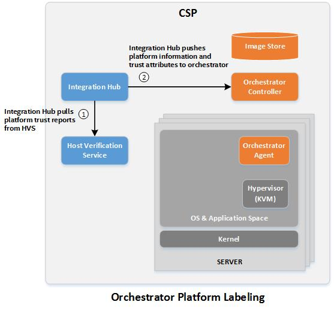

# Platform Integrity Attestation 

Platform attestation is the cornerstone use case for ISecL. Platform
attestation involves taking measurements of system components during
system boot, and then cryptographically verifying that the actual
measurements taken matched a set of expected or approved values,
ensuring that the measured components were in an acceptable or "**trusted**"
state at the time of the last system boot.

ISecL leverages the Trusted Compute Group specification for a trusted
boot process, extending measurements of platform components to registers
in a Trusted Platform Module, and securely generating quotes of those
measurements from the TPM for remote comparison to expected values
(attestation).

This section includes basic REST API examples for these workflows. See
the Javadoc for more detailed documentation on REST APIs supported by
ISecL.

Typical workflows in the datacenter might include:

-   Creating a set of acceptable flavors for attestation with automatic
    flavor matching that represent the known-good measurements for
    acceptable BIOS and OS versions in the datacenter

-   Registering hosts for attestation with automatic flavor matching

-   Upgrading hosts in the datacenter to a new BIOS or OS version

-   Removing hosts from the Verification Service

-   Removing flavors

-   Provisioning asset tags to hosts

-   Invalidating asset tags

-   Retrieving current attestation reports

-   Retrieving current host state information

-   Remediating an untrusted attestation

## Host Registration
-----------------

Registration creates a host record with connectivity details and other
host information in the Verification Service database. This host record
will be used by the Verification Service to retrieve TPM attestation
quotes from the Trust Agent to generate an attestation report.

### Trust Agent

#### Registration via Trust Agent Command Line

The Trust Agent can register the host with a Verification Service by
running the following command:

```shell
tagent setup create-host 
```

???+ note 
    The following environment variables must be exported for this command:
```shell
HVS_URL=https://<hvs_IP/hostname>:8443/hvs/v2
CURRENT_IP=<trustagent_IP>
BEARER_TOKEN=<authentication token>
```

???+ note 
    Because VMWare ESXi hosts do not use a Trust Agent, this method is not applicable for registration of ESXi hosts.

### Registration via Verification Service API

Any Trust Agent or VMware ESXi host/cluster can be registered using a
Verification Service API request. Registration can be performed with or
without a set of existing Flavors. Rules for Flavor matching can be set
by using the Flavor Group in the request; if no Flavor Group is
specified, the `automatic` Flavor Group will be used. See the
Flavor Management section for additional details on Flavors, Flavor
Groups, and Flavor matching.

#### Sample Call

```json
POST https://verification.service.com:8443/hvs/v2/hosts
Authorization: Bearer <token>

{
    "host_name": "<hostname of host to be registered>",
    "connection_string": "<connection string>",
    "flavorgroup_name" : "",
    "description" : "<description>"
}
```

Requires the permission `hosts:create`

#### Sample Call for ESXi Cluster Registration

```json
POST https://verification.service.com:8443/hvs/v2/hosts
Authorization: Bearer <token>

{
    " esxi_clusters": [
       {
          "connection_string": "<password>",
          "cluster_name": "<cluster name>"
       }
    ]
 }
```

Requires the permission `esxi_clusters:create`


##Flavor Creation for Automatic Flavor Matching
---------------------------------------------

Flavor creation is the process of adding one or more sets of acceptable
measurements to the Verification Service database. These measurements
correspond to specific system components, and are used as the basis of
comparison to generate trust attestations.

Flavors can be created manually, or can be imported from an example
host.

Flavors are automatically matched to hosts based on the Flavorgroup used
by the host and the Flavors, and the Flavor Match Policies of the
Flavorgroup. The ISecL Verification Service creates a default
Flavorgroups during installation called "**automatic**" This Flavorgroup is
configured to be used as a pool of all acceptable Flavors in a given
environment, and will automatically match the appropriate Flavor parts
to the correct host. This Flavorgroup is used by default and is expected
to be useful for the majority of deployments. If no Flavorgroup is
specified when creating a Flavor, it will be placed in the "**automatic**"
Flavorgroup.

Flavors are also divided into Flavor parts, which correspond to the
`PLATFORM`, `OS`, `HOST_UNIQUE`, `SOFTWARE`, and `ASSET_TAG` measurements. These
can be created and maintained separately (so that users can manage
acceptable OS and BIOS versions, rather than entire host
configurations). By default, if not specified, the Verification Service
will import Flavors as separate Flavor parts, as appropriate for the
host type.

By using individual Flavor parts, individual versions of OS or PLATFORM
measurements can be managed and automatically mapped. Whenever a host
changes states (Untrusted, Connected, etc.) the Verification Service
will attempt to match appropriate Flavors to that host. If a Flavor is
removed or added, all appropriate hosts will be updated to use the new
Flavor, or to no longer use the deleted Flavor. Hosts that are currently
using a BIOS where that BIOS versions’ PLATFORM Flavor was deleted will
now appear Untrusted, for example. This can be used to easily flag as
Untrusted hosts that are using software that has been End-Of-Lifed, or
perhaps an OS kernel with a known security vulnerability.

???+ note 
    See the Flavor Management section for additional details on how flavors can be managed, and how the Flavor matching engine works. The sample workflow provided here is intended to be an introduction only.

### Importing a Flavor from a Sample Host

```json
POST https://verification.service.com:8443/hvs/v2/flavors
Authorization: Bearer <token>

{ 
    "connection_string": "<connection string>",
    "partial_flavor_types": ["PLATFORM", "OS", "HOST_UNIQUE"],
    "flavorgroup_names": []
}
```

Requires the permission `flavors:create`

???+ note 
    The HOST\_UNIQUE Flavor parts, used by Red Hat Enterprise Linux and VMWare ESXi host types, MUST be created for each registered host of that type, and should in general be imported from that host. This means that importing the HOST\_UNIQUE flavor should always be done for each host registered.

To import ONLY the HOST\_UNIQUE Flavor part from a host:

```json
POST https://verification.service.com:8443/hvs/v2/flavors
Authorization: Bearer <token>

{ 
    "connection_string": "<connection string>",
    "partial_flavor_types": ["HOST_UNIQUE"],
    flavorgroup_names": []
}
```

Requires the permission `flavors:create`

### Creating a Flavor Manually

Flavors can be directly created (rather than importing from a sample
host) if the required information is known. If no Flavorgroup is
specified, the Flavor will be placed in the `automatic` group. Note that
the `label` is a required field and must be unique.

```json
POST https://verification.service.com:8443/hvs/v2/flavors
Authorization: Bearer <token>

{
    "connection_string": "",
    "flavor_collection": {
        "flavors": [
            {
                "meta": {
                    "vendor": "INTEL",
                    "description": {
                        "flavor_part": "PLATFORM",
                        "label": "Intel Corporation_SE5C610.86B.01.01.1008.031920151331_TPM2.0",
                        "bios_name": "Intel Corporation",
                        "bios_version": "SE5C620.86B.00.01.0004.071220170215",
                        "tpm_version": "2.0"
                    }
                },
                "hardware": {
                    "processor_info": "…",
                    "processor_flags": "…",
                    "feature": {
                        "tpm": {
                            "enabled": true,
                            "pcr_banks": [
                                "SHA1",
                                "SHA256"
                            ]
                        },
                        "txt": {
                            "enabled": true
                        }
                    }
                },
                "pcrs": {
                    "SHA1": {
                        "pcr_0": {
                            "value": "d2ed125942726641a7260c4f92beb67d531a0def"
                        },
                        "pcr_17": {
                            "value": "1ec12004b371e3afd43d04155abde7476a3794fa",
                            "event": ...
                        }
                    
```

Requires the permission `flavors:create`


##Creating the Default SOFTWARE Flavor (Linux Only)
-------------------------------------------------

As part of the new Application Integrity feature added in Intel® SecL-DC
version 1.5, a new default SOFTWARE Flavor part is provided so that the
Linux Trust Agent itself can be measured and included in the attestation
process. The default SOFTWARE Flavor includes a manifest for the static
files and folders in the Trust Agent. The manifest is automatically
deployed to each Linux Trust Agent during the provisioning step.

???+ note 
    The Linux Trust Agent **must** be rebooted after the Provisioning step is completed (typically Provisioning happens during installation, based on whether all of the required variables are set in the trustagent.env file). Rebooting allows the default SOFTWARE Flavor manifest to be measured and extended to the TPM PCRs. If the reboot is not performed, the system will require a SOFTWARE Flavor, but the measurements will not exist, and the system will appear Untrusted. If an un-rebooted host is used to create the SOFTWARE Flavor, the Flavor will be created based on measurements that do not exist, and will fail.

The `SOFTWARE` Flavor part should be created separately from the other
Flavor parts. Only one default `SOFTWARE` Flavor needs to be created for
each version of the Linux Trust Agent. If the `SOFTWARE` Flavor for the
same Trust Agent version is imported multiple times, subsequent imports
will fail as the Flavor already exists.

To import the `SOFTWARE` Flavor part from a host:

```json
POST https://verification.service.com:8443/hvs/v2/flavors
Authorization: Bearer <token>

{ 
    "connection_string": "<connection string>",
    "partial_flavor_types": ["SOFTWARE"],
    flavorgroup_names": []
}
```

Requires the permission `flavors:create`


##Creating and Provisioning Asset Tags
------------------------------------

Asset Tags represent a set of key/value pairs that can be associated
with a host in hardware. This enables usages around restricting
workflows to specific hosts based on tags, which could include location
information, compliance tags, etc.

ISecL creates Asset Tags by creating a certificate containing the list
of key/value pairs to be tagged to the host, with the host’s hardware
UUID as the certificate subject. A hash of this certificate is then
written to an NVRAM index in the host’s TPM. This value is included in
TPM quotes, and can be attested using an Asset Tag flavor that matches
up the expected value and the actual key/value pairs.

### Creating Asset Tag Certificates

Asset Tag certificates can be created with a single REST API call, with
any number of key/value pairs. Note that one certificate must be created
for each host to be tagged, even if they will all be tagged with
identical key/value pairs.

```json
POST https://verification.service.com:8443/hvs/v2/tag-certificates
Authorization: Bearer <token>

{
    "hardware_uuid": "<hardware UUID of host to be tagged>",
    "selection_content": [
        {
            "name": "<key>",
            "value": "<value>"
        },
        {
            "name": "<key>",
            "value": "<value>"
        },
        {
            "name": "<key>",
            "value": "<value>"
        }
    ]
}
```

### Deploying Asset Tags

#### Red Hat Enterprise Linux

Asset Tags can be provisioned to a Windows or RHEL host via a REST API
request on the Verification Service that will in turn make a request to
the Trust Agent on the host to be tagged.

```json
POST https://verification.service.com:8443/hvs/v2/rpc/deploy-tag-certificate
Authorization: Bearer <token>

{
    "certificate_id": "<certificate ID>"
}
```

#### VMWare

Since VMWare ESXi hosts do not use a Trust Agent, the process for
writing Asset Tags to a VMWare host is different from RHEL. A
new interface has been added to ESXi via a new `esxcli` command starting
in vSphere 6.5 Update 2 that allows the Asset Tag information to be
written to the TPM via a command-line command. The older process is also
described below.

The high-level workflow for using Asset Tags with VMWare ESXi is:

1.  Create the Asset Tag Certificate for the host.
2.  Calculate the Certificate Hash value.
3.  Provision the Certificate Hash value to the host TPM and reboot
4.  Create the Asset Tag Flavor.

???+ note 
    Asset Tag is currently not supported for VMWare hosts using TPM 2.0.

##### Calculate the Certificate Hash Value

Only the hash value of the Asset Tag Certificate can be provisioned to
the TPM, due to the low size of the NVRAM.

1.  Retrieve the Asset Tag Certificate. The Asset Tag Certificate can be
    retrieved either from the response when the Asset Tag certificate is
    created, or by using a GET API request to retrieve the certificate:
    
    ```json
    GET https://verification.service.com:8443/hvs/v2/tag-certificates?subjectEqualTo=<HardwareUUID>
    Authorization: Bearer <token>
    ```
    
2.  Copy only the `certificate` value (this will be the certificate in
    encoded format) and write the data to a file on a Linux system.
    Remove any line breaks and save the file. Assuming the filename used
    is `tag-cert` use the following to generate the correct hash:

    ```shell
    cat tag-cert | base64 --decode | openssl dgst -sha1 | awk -F" " '{print $2}'
    ```
    
    This hash value will be what is actually written to the TPM NVRAM.

##### Provision the Certificate Hash to the Host TPM

Due to a new feature added in vSphere 6.5 Update 2, the process for
provisioning Asset Tags on VMWare ESXi hosts has been significantly
improved. Both the old and new process for provisioning Asset Tags is
documented below. Intel recommends using vSphere 6.5 Update 2 or later
due to the significant difference in the process.

###### **vSphere 6.5 Update 2 or Later**

Starting in ESXi 6.5u2, you can now use SSH to write Asset Tags directly
with no need for TPM clears, reboots, PXE, or BIOS access. SSH to the
ESXi host using root credentials. Then use the command:

  ```shell
  esxcli hardware tpm tag set -d <hash>
  ```

You can use the following command to verify that the tag was written:
    
  ```shell
  esxcli hardware tpm tag get
  ```

Reboot the host. After rebooting, the TPM PCR 22 will have the measured value of the hash.

###### **vSphere 6.5 Update 1 or Older**

There is no direct interface from VMWare vCenter or ESXi previous to
vSphere 6.5 Update 2 that will write the Tag information to the host
TPM.

Writing Asset Tag information to a TPM requires TPM ownership; VMWare
ESXi takes TPM ownership with a secret password at boot time. This means
that the process for writing Asset Tags to a VMWare host requires:

1.  Clear TPM ownership.

    * This can be done via the system BIOS, or using One Touch Activation
      through the IPMI interface (if enabled by the server OEM).

2. Reactivate TPM/TXT.
   * This can be done via the system BIOS, or using One Touch Activation
     through the IPMI interface (if enabled by the server OEM).

3. Booting to an OS that has the ability to issue TPM commands
   * Typically the provisioning OS used is Ubuntu or RHEL, booted
     temporarily using PXE.

4. Writing the Tag information
   * The TPM index 0x40000010 must be defined, and the hash of the Asset
     Tag certificate must be written to that index.

5. Clear TPM ownership.
   * This can be done via the system BIOS, or using One Touch Activation
     through the IPMI interface (if enabled by the server OEM).

6. Reactivate TPM/TXT
   * This can be done via the system BIOS, or using One Touch Activation
     through the IPMI interface (if enabled by the server OEM).

7. Boot back to VMWare ESXi.

When the system is rebooted to ESXi, the Trusted Boot process will
extend the value to PCR22, and this value can be used during
attestation.

##### Creating the Asset Tag Flavor (VMWare ESXi Only)

While for RHEL and Windows hosts the Asset Tag Flavor is automatically
created during the Tag Provisioning step, for VMWare ESXi hosts the
Flavor must be created by importing it from the host after the Tag has
been provisioned.

```json
POST https://verification.service.com:8443/hvs/v2/flavors
Authorization: Bearer <token>

{   
    "connection_string": "<VMWare vCenter connection string>",
    "partial_flavor_types": ["ASSET_TAG"]
}
```

Once the Asset Tag Flavor is imported, the host can be attested
including Asset Tags as normal.


##Retrieving Current Attestation Reports
--------------------------------------

```
GET https://verification.service.com:8443/hvs/v2/reports?latestPerHost=true
Authorization: Bearer <token>
```


##Retrieving Current Host State Information
-----------------------------------------

```
GET https://verification.service.com:8443/hvs/v2/host-status?latestPerHost=true
Authorization: Bearer <token>
```


##Upgrading Hosts in the Datacenter to a New BIOS or OS Version
-------------------------------------------------------------

Software and firmware updates are a common occurrence in the datacenter.
Automatic Flavor matching makes this process relatively simple:

1.  Create a new Flavor for the new version. This may be manually
    created or imported directly from a sample host that has already
    received the upgrade. Be sure to create new Flavors for each TPM
    version represented in your datacenter.
    
    ```json
    POST https://verification.service.com:8443/hvs/v2/flavors
    Authorization: Bearer <token>
    
    { 
        "connection_string": "<connection string>",
        "partial_flavor_types": ["PLATFORM", "OS", "HOST_UNIQUE"],
        flavorgroup_names": []
    }
    ```
    
2.  Update the hosts to the new software or firmware version as normal.
    On the next attestation attempt, the Verification Service will
    automatically match the updated hosts to the new Flavor.

3.  (Optional) If desired, delete the Flavor for the older version after
    the update is completed. This will cause any hosts that are still
    using the old version to attest as Untrusted. Which can easily flag
    hosts that missed the upgrade for remediation.

    ```
    DELETE https://verification.service.com:8443/hvs/v2/flavors/<flavorId>
    Authorization: Bearer <token>
    ```

    

##Removing Hosts From the Verification Service
--------------------------------------------

Hosts can be deleted at any time. Reports for that host will remain in
the Verification Service database for audit purposes.

```
DELETE https://verification.service.com:8443/hvs/v2/hosts/<hostId>
Authorization: Bearer <token>
```

The `hostId` can be retrieved either at the time the host is created, or
by searching hosts using the host’s hostname.


##Removing Flavors
----------------

Flavors can be deleted; this will cause any hosts that match the deleted
Flavor to evaluate as Untrusted. This can be done if, for example, an
old BIOS version needs to be retired and should no longer exist in the
datacenter. By deleting the PLATFORM Flavor, hosts with the old BIOS
version will attest as Untrusted, flagging them for easy remediation.

```
DELETE https://verification.service.com:8443/hvs/v2/flavors/<flavorId>
```


##Invalidating Asset Tags
-----------------------

Asset Tags can be deleted in two ways.

Deleting the `ASSET_TAG` Flavor part will retain the Asset Tag
certificate in the database, but will cause the host using this Tag to
no longer use the Asset Tag for attestation (the Tag result will be
disregarded and no tags will be exposed in the attestation Reports).

```
DELETE https://verification.service.com:8443/hvs/v2/flavors/<assetTagflavorId>
Authorization: Bearer <token>
```

Deleting the actual Asset Tag certificate will remove the certificate
from the database, but will not actually affect attestation results (the
authority for attestation results is the Flavor).

```
DELETE https://verification.service.com:8443/hvs/v2/tag-certificates/<assetTagCertificateId>
Authorization: Bearer <token>
```


##Remediating an Untrusted attestation
------------------------------------

Hosts can become Untrusted for a wide variety of causes. The first clue
to finding the root cause for an Untrusted attestation is the
attestation Report itself – the Report will show Trust results for the
`PLATFORM`, `OS`, `HOST_UNIQUE`, and `ASSET_TAG` Flavor parts individually,
along with the `OVERALL` trust. If the Report shows that the PLATFORM
Flavor part trust is “false” for example, it means that the PLATFORM
measurements did not match any Flavors in the host’s Flavorgroup.

Untrusted attestation Reports will contain **faults** that describe the
specific attestation rules that were not satisfied. This often shows
enough information to describe the cause of the Untrusted status. A
fault like **RequiredButNotDefined** means that a Flavor part is required
by the Flavorgroup policy, but no Flavors for that Flavor part exist in
the Flavorgroup (for example, generally Flavorgroups should always
require a PLATFORM Flavor part; if no PLATFORM Flavors are in the
Flavorgroup, hosts in the Flavorgroup will attest with this fault).

Other faults include:

**"PcrMatchesConstant"** - describes a rule that evaluates whether a TPM
PCR has a specific value

**"PcrEventLogIntegrity"** - the module event log is replayed during
attestation to verify that the resulting measurement matches the actual
value in the module PCR. If the replay does not match, it indicates the
event log cannot itself be trusted.

**"AikCertificateTrusted"** – This rule evaluates whether the TPM quote
was signed by the TPM associated with this host. As part of host
registration, the public half of the Attestation Identity Keypair is
captured, and this public key is used to verify the signature on TPM
quotes from that host.

See the Appendix for a full list of the rules evaluated during
Attestation.

The Flavor matching engine will use the most-similar Flavor for the
attestation Report in the case of an Untrusted result.

The fault will explain in a general sense what rule the host attestation
violated. To remediate, the rule will need to be satisfied. This could
mean creating a new Flavor to match the actual observed values, or it
could mean that the host has been tampered with and should have its BIOS
flashed or OS reloaded.


##Attestation Reporting
---------------------

Attestation results are delivered in the form of Host Reports. A Report
can delivered in several different formats, which can change the type of
data returned.

The preferred format for Host Reports is a SAML attestation. A
SAML-formatted report includes a chain or signatures that provides
auditability for the Report. The SAML attestation will include the base
trust status of the host, as well as the overall trust for each
individual Flavor used in the attestation. The Report will also contain
host information, such as TPM version, Operating System name and
version, BIOS version, etc. The SAML Report will not, however, contain
individual measurements and comparisons of values. This format of the
Report is ideal for securely communicating the trust status of a host
and for audit history.

Attestation Reports can also be retrieved in `json` or `xml` format. These
formats will not include the signature chain provided in the SAML
format, but will contain the actual measurement values and expected
Flavor values used for comparison. These reports are typically used for
remediation, because they will show specifically why a given Host
attested as Untrusted.

The format for a Report is determined by the `Accept` header in the
request.

Attestations are automatically generated in the Verification Service by
a repeating scheduled background process. This process looks for
Attestation Reports that are close to expiration, and triggers a new
Attestation Report. By default, Attestation Reports are valid for 90
minutes, and the background refresh process will trigger a new
attestation when a Report is found to be within 3 minutes of expiration.

A user can either retrieve the most recent currently valid Attestation
Report for a given host, or may trigger a new Attestation Report to be
generated. Typically, it is best to retrieve an existing Report for
performance reasons. Generating a new Attestation Report requires the
generation of a new TPM quote from the TPM of the host being attested;
TPM performance differs greatly between vendors, and a quote can take
anywhere between 2-7 seconds to generate.

### Sample Call – Generating a New Attestation Report

```json
POST https://verification.service.com:8443/hvs/v2/reports
Authorization: Bearer <token>

{
    "host_name":"host-1"
}
```

Requires the permission `reports:create`

### Sample Call – Retrieving an Existing Attestation Report

```
GET https://verification.service.com:8443/hvs/v2/reports?hostName=HostName.server.com
Authorization: Bearer <token>
```

Below are the supported criteria options in order of precedence. If no
host filter criteria is specified, then results are returned for all
active hosts.

-   `id` - unique UUID of the report entry in the database

-   `hostId` - unique UUID of the host entry in the database

-   `hostName` - name of the host

-   `hostHardwareId` - hardware UUID of the host

-   `hostStatus` - current state of the host, which supports the following
    options:
    
    * CONNECTED - host is in connected state
    * QUEUE - host is in queue to be processed
    * CONNECTION\_FAILURE - connection failure
    * UNAUTHORIZED - unauthorized
    * AIK\_NOT\_PROVISIONED - AIK certificate is not provisioned
    * EC\_NOT\_PRESENT - endorsement certificate is not present
    * MEASURED\_LAUNCH\_FAILURE - TXT measured launch failure
    * TPM\_OWNERSHIP\_FAILURE - TPM ownership failureTPM\_NOT\_PRESENT - TPM is not present
    * UNSUPPORTED\_TPM - unsupported TPM version
    * UNKNOWN - unknown host state

Requires the permissions `reports:search`

Other search criteria may also be used. By default, the most recent
currently valid attestation is returned. However, different query
parameters can be used to retrieve all attestations for a specific host
over the last 30 days, for example.


##Integration
-----------

Intel® SecL can be integrated with scheduler services (or potentially
other services) to provide additional security controls. For example, by
integrating Intel® SecL with the OpenStack scheduler service, the
OpenStack placement service can incorporate the Intel® SecL security
attributes into VM scheduling.

### The Integration Hub

The Integration Hub acts as the integration point between the Verification Service and a third party service. The primary purpose of the Hub is to collect and maintain up-to-date attestation information, and to “push” that information to the external service. The secondary purpose is to allow for multitenancy, the Verification Service does not allow for permissions to be applied for specific hosts, so a user with the “attestation” role can access all attestations for all hosts. By using separate Integration Hub instances for each Cloud environment (or "tenant"), the Hub will push attestations only for the associated hosts to a given tenant’s integration endpoints.

For example, Tenant A is using hosts 1-10 for an OpenStack environment. Tenant B is using hosts 11-15 for a Kubernetes environment. Two Hub instances must be configured, one managing tenant A's OpenStack cluster and a second instance managing Tenant B's Kubernetes environment.  Each integration Hub will automatically retrieve the list of hosts used by its configured orchestration endpoint, retrieve the attestation reports only for those hosts, and push the attestation attribute information to each configured endpoint. Neither tenant will have access to the Verification Service, and will not be able to see attestation or other host details regarding infrastructure used by other tenants.

Different integration endpoints can be added to the Integration Hub through a plugin architecture. By default, the Integration Hub includes plugins for OpenStack and Kubernetes (Kubernetes deployments require the additional installation of two Intel® SecL-DC Custom Resource Definitions on the Kube Control Plane).



### Integration with OpenStack 

Starting in the Rocky release, OpenStack can now use “Traits” to provide qualitative data about Nova Compute hosts, and to establish Trait requirements for VM instances. The updated scheduler will place VMs
requiring a given Trait on Nova Compute nodes that meet the Trait requirements.

Intel SecL-DC uses the Integration Hub to continually push platform integrity and Asset Tag information to the OpenStack Traits resources.  This means the OpenStack scheduler natively supports workload scheduling incorporating Intel SecL-DC security attributes, including attestation report Trust status and Asset Tags. The OpenStack Placement Service will automatically attempt to place images with Trait requirements on compute nodes that have those Traits.

???+ note 
    This control only applies to instances launched using the OpenStack scheduler, and the Traits functions will not affect manually-launched instances where a specific Compute Node is defined (since this does not use the scheduler at all). Intel SecL-DC uses existing OpenStack interfaces and does not modify OpenStack code.  The datacenter owner or OpenStack administrator is responsible for the security of the OpenStack workload scheduling process in general, and Intel recommends following published OpenStack security best practices.

#### Prerequisites

-   Verification Service must be installed and running.

-   OpenStack\* Rocky (or later) Nova, Glance, Horizon, and Keystone services must
    be installed and running

-   The Integration Hub must be installed and running.

#### Setting Image Traits

Image Traits define the policy for which Traits are required for that
Image to be launched on a Nova Compute node. By setting these Traits to
“required,” the OpenStack scheduler will require these same Traits to be
present on a Nova Compute node in order to launch instances of the
image.

To set the Image Traits for Intel SecL-DC, a specific naming convention
is used. This naming convention will match the Traits that the
Integration Hub will automatically push to OpenStack. Two types of
Traits are currently supported – one Trait is used to require that the
Compute Node be Trusted in the Attestation Report, and the other Trait
is used to require specific Asset Tag key/value pairs.

To require a `Trusted` Attestation Report:

```
CUSTOM_ISECL_TRUSTED=required
```

The naming convention for Asset Tags is more flexible, and any number of
these Traits can be used simultaneously.

???+ note 
    All of the Traits must be present on the Compute Node for the scheduler to allow instances to land, so be sure not to set mutually exclusive Asset Tag values.

```
CUSTOM_ISECL_AT_TAG_<key>_<value>=required`
```

For example, to define a Trait that will require an Asset Tag where
`State = CA` use the following:

```
CUSTOM_ISECL_AT_TAG_STATE_CA= required
```

These Traits can be set using CLI commands for OpenStack Glance:

```shell
openstack image set --property trait:CUSTOM_ISECL_AT_STATE__CA=required <image_name>
```

```shell
openstack image set --property trait:CUSTOM_ISECL_TRUSTED=required <image_name>
```

To remove a Trait so that it is no longer required for an Image:

```shell
openstack image unset --property trait:CUSTOM_ISECL_AT_STATE__CA <image_name>
```

```shell
openstack image unset --property trait:CUSTOM_ISECL_TRUSTED <image_name>
```

#### Configuring the Integration Hub for Use with OpenStack

The Integration Hub must be configured with the API URLs and credentials for the OpenStack instance it will integrate with.  This can be done during installation using the "OPENSTACK_..." variables shown in the `ihub.env` answer file  sample (see the Installing the Integration Hub section).

However, this configuration can also be performed after installation using CLI commands:

```
ihub setup openstack --endpoint-url="http://openstack:5000/v3" --endpoint-user="username" --endpoint-pass="password"
```

Restart the Integration Hub after configuring the endpoint. Note that "endpoint name" should be replaced with any user-friendly name for the OpenStack instance you would prefer.

#### Scheduling Instances

Once Trait requirements are set for Images and the Integration Hub is
configured to push attributes to OpenStack, instances can be launched in
OpenStack as normal. As long as the OpenStack Nova scheduler is used to
schedule the workloads, only compliant Compute Nodes will be scheduled
to run instances of controlled Images.

???+ note 
    This control only applies to instances launched using the OpenStack scheduler, and the Traits functions will not affect manually-launched instances where a specific Compute Node is defined (since this does not use the scheduler at all). Intel SecL-DC uses existing OpenStack interfaces and does not modify OpenStack code.  The datacenter owner or OpenStack administrator is responsible for the security of the OpenStack workload scheduling process in general, and Intel recommends following published OpenStack security best practices.

### Integration with Kubernetes

Through the use of Custom Resource Definitions for the Kubernetes
Control Plane, Intel® Security Libraries can make Kubernetes aware of Intel®
SecL security attributes and make them available for pod orchestration.
In this way, a security-sensitive pod can be launched only on `Trusted`
physical worker nodes, or on physical worker nodes that match specified
Asset Tag values.

???+ note 
    This control only applies to pods launched using the Kubernetes scheduler, and these scheduling controls will not affect manually-launched instances where a specific worker node is defined (since this does not use the scheduler at all). Intel SecL-DC uses existing Kubernetes interfaces and does not modify Kubernetes code, using only the standard Custom Resource Definition mechanism to add this functionality to the Kubernetes Control Plane.  The datacenter owner or Kubernetes administrator is responsible for the security of the Kubernetes workload scheduling process in general, and Intel recommends following published Kubernetes security best practices.

#### Prerequisites

-   Verification Service must be installed and running.

-   Kubernetes Control Plane Node must be installed and running

-   The supported Kubernetes versions are from `1.14.8`-`1.17.3` and the
    integration is validated with `1.14.8` and `1.17.3`

-   Kubernetes Worker Nodes must be configured as physical hosts and
    attached to the Control Plane Node


#### Installing the Intel® SecL Custom Resource Definitions

Intel® SecL uses Custom Resource Definitions to add the ability to base
orchestration decisions on Intel® SecL security attributes to
Kubernetes. These CRDs allow Kubernetes administrators to configure pods
to require specific security attributes so that the Kubernetes Control Plane
Node will schedule those pods only on Worker Nodes that match the
specified attributes.

Two CRDs are required for integration with Intel® SecL – an extension
for the Control Plane nodes, and a scheduler extension. A single installer will
deploy both of these CRDs. The extensions are deployed as a Kubernetes
deployment in the `isecl` namespace.

???+ note 
    Please refer detail steps given for  `3.15 Installing the Intel® SecL Kubernetes Extensions and Integration Hub` section.


#### Configuring Pods to Require Intel® SecL Attributes

1.  (Optional) Verify that the worker nodes have had their Intel® SecL
    security attributes populated:
    
    ```shell
    kubectl get nodes --show-labels
    ```
    
    The output should show the Trust staus and any Asset Tags applied to
    all of the registered Worker Nodes.
    
2.  Add the following to any Pod creation files:

    ```yaml
    spec:
      affinity:
        nodeAffinity:
          requiredDuringSchedulingIgnoredDuringExecution:
            nodeSelectorTerms:
              - matchExpressions:
                  - key: isecl.trusted
                    operator: In
                    values:
                      - "true"
                  - key: isecl.TAG_Country
                    operator: In
                    values:
                      - CA
                      - US
                  - key: isecl.TAG_Customer
                    operator: In
                    values:
                      - Coke
                      - Pepsi
                  - key: isecl.TAG_State
                    operator: In
                    values:
                      - CA
    ```


The `isecl.trusted` key defines the requirement for a Trusted host. Only
one of these keys should be used. The `isecl.TAG_` keys indicate Asset
Tags; if the workload should only launch on hosts with the `COUNTRY=US` Asset Tag, the pod should be launched with the matchExpression key
`isecl.TAG_COUNTRY` with the value `US`.

All of the matchExpression definitions must be true for a given worker
node to launch the pod – in the example above, the host must be
attested as Trusted with Asset Tags `Country=US` ,`Customer=Customer1` and `State=CA`. If the worker node has
additional Asset Tags beyond the ones required, the pod will still be
able to be launched on that node. However, if one of the specified
Tags is missing or has a different value, that worker node will not be
used for that pod.

#### Tainting Untrusted Worker Nodes

Optionally, the Intel® SecL Kubernetes CRDs can be configured to flag
worker nodes as `tainted` to prevent any pods from launching on them.
This restriction is applied regardless of whether the pod has a specific
trust policy – if a worker node is flagged as `tainted` no pods will be
launched on that worker.

This setting is disabled by default. To enable this setting:

1.  Edit the `isecl-controller.yaml` file under
    `/opt/isecl-k8s-extensions/yamls/isecl-controller.yaml` and set
    `TAINT_UNTRUSTED_NODES=true`

2.  Run
    
    ```shell
    kubectl apply -f /opt/isecl-k8s-extensions/yamls/isecl-controller.yaml
    ```

Worker nodes that attest as untrusted will be `tainted` with the
NoExecute flag and unable to launch pods.

If a worker was previously considered tainted and the untrusted state is
resolved, the Intel® SecL CRDs will remove the tainted flag and the
worker will be able to launch pods again.
