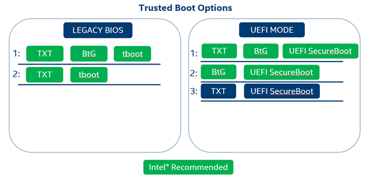

# Introduction 

## Overview

Intel Security Libraries for Datacenter is a collection of software applications and development libraries intended to help turn Intel platform security  features into real-world security use cases.

## Trusted Computing

Trusted Computing consists of a set of industry standards defined by the Trusted Computing Group to harden systems and data against attack. These
standards include verifying platform integrity, establishing identity, protection of keys and secrets, and more. One of the functions of Intel Security Libraries is to provide a “Trusted Platform,” using Intel security technologies to add visibility, auditability, and control to server platforms.

### The Chain of Trust

In a Trusted Computing environment, a key concept is verification of the integrity of the underlying platform. Verifying platform integrity typically means cryptographic measurement and/or verification of firmware and software components. The process by which this measurement and verification takes place affects the overall strength of the assertion that the measured and verified components have not been altered. Intel refers to this process as the “*Chain of Trust*,” whereby at boot time, a sequence of cryptographic measurements and signature verification events happen in a defined order, such that
measurement/verification happens before execution, and each entity responsible for performing a measurement or verification is measured by
another step earlier in the process. Any break in this chain leads to an opportunity for an attacker to modify code and evade detection.

### Hardware Root of Trust

The *Root of Trust,* the first link in the chain, can be one of several different options. Anything that happens in the boot process before the Root of Trust must be considered to be within the “trust boundary,” signifying components whose trustworthiness cannot be assessed. For this reason, it’s best to use a Root of Trust that starts as early in the system boot process as possible, so that the Chain of Trust during the boot process can cover as much as possible.

Multiple Root of Trust options exist, ranging from firmware to hardware. In general, a hardware Root of Trust will have a smaller “trust
boundary” than a firmware Root of Trust. A hardware Root of Trust will also have the benefit of immutability – where firmware can easily be
flashed and modified, hardware is much more difficult to tamper with.

#### Intel® Trusted Execution Technology (Intel® TXT)

Intel® Trusted Execution Technology is a hardware Root of Trust feature available on Intel® server platforms starting with the Grantley generation. Intel® TXT is enabled in the system BIOS (typically under the Processor \> Advanced tab), and requires Intel® VT-d and Intel VT-x features to be enabled as prerequisites (otherwise the option will be grayed out). Intel® TXT will ship “disabled” by default.

#### Intel® BootGuard (Intel® BtG)

Intel® BootGuard is a hardware Root of Trust feature available on Intel® server platforms starting with the Purley-Refresh generation. Unlike
Intel® TXT, Intel® BtG is configured in platform fuses, not in the system BIOS. Intel® BtG is fused into several “profiles” that determine the behavior of the feature. Intel® BtG supports both “verify” and “measure” profiles; in “verify” profiles, Intel® BtG will verify the signature of the platform Initial Boot Block (IBB). In “measure”profiles, Intel® BtG will hash the IBB and extend that measurement to a TPM PCR. It is recommended that Intel® BtG be fused into the “measure and verify” profile for maximum protection and auditability.

Because the Intel® BtG profile is configured using fuses, the server OEM/ODM will determine the profile used at manufacturing time. Please contact your server vendor to determine what Intel® BtG profiles are available in their product line.

Because Intel® BtG only measures/verifies the integrity of the IBB, it’s important to have an additional technology handle measurements later in the boot process. Intel® TXT can provide this function using tboot to invoke SINIT, and UEFI SecureBoot can alternatively provide similar functionality (note that Linux users should properly configure Shim and use a signed kernel for UEFI SecureBoot).

### Supported Trusted Boot Options

Intel® SecL-DC supports several options for Trusted Computing, depending
on the features available on the platform.

  

### Remote Attestation

Trusted computing consists primarily of two activities – measurement, and attestation. Measurement is the act of obtaining cryptographic representations for the system state. Attestation is the act of comparing those cryptographic measurements against expected values to determine whether the system booted into an acceptable state.

Attestation can be performed either locally, on the same host that is to be attested, or remotely, by an external authority. The trusted boot process can optionally include a local attestation involving the evaluation of a TPM-stored Launch Control Policy (LCP). In this case, the host’s TPM will compare the measurements that have been taken so far to a set of expected PCR values stored in the LCP; if there is a mismatch, the boot process is halted entirely.

Intel® SecL utilizes remote attestation, providing a remote Verification Service that maintains a database of expected measurements (or “flavors”), and compares the actual boot-time measurements from any number of hosts against its database to provide an assertion that the host booted into a “trusted” or “untrusted” state. Remote attestation is typically easier to centrally manage (as opposed to creating an LCP for each host and entering the policy into the host’s TPM), does not halt the boot process allowing for easier remediation, and separates the attack surface into separate components that must both be compromised to bypass security controls.

Both local and remote attestation can be used concurrently. However, Intel® SecL, and this document, will focus only on remote attestation. For more information on TPM Launch Control Policies, consult the [*Intel Trusted Execution Technology (Intel TXT) Software Development Guide*](https://www.intel.com/content/dam/www/public/us/en/documents/guides/intel-txt-software-development-guide.pdf).

## Intel® Security Libraries for Datacenter Features

### Platform Integrity

Platform Integrity is the use case enabled by the specific implementation of the Chain of Trust and Remote Attestation concepts. This involves the use of a Root of Trust to begin an unbroken chain of platform measurements at server boot time, with measurements extended to the Trusted Platform Module and compared against expected values to verify the integrity of measured components. This use case is foundational for other Intel® SecL use cases.

### Data Sovereignty

Data Sovereignty builds on the Platform Integrity use case to allow physical TPMs to be written with Asset Tags containing any number of key/value pairs. This use case is typically used to identify the geographic location of the physical server, but can also be used to identify other attributes. For example, the Asset Tags provided by the Data Sovereignty use case could be used to identify hosts that meet specific compliance requirements and can run controlled workloads.

### Application Integrity

Added in the Intel® SecL-DC 1.5 release, Application Integrity allows any files and folders on a Linux host system to be included in the Chain of Trust integrity measurements. These measurements are attested by the Verification Service along with the other platform measurements, and are included in determining the host’s overall Trust status. The measurements are performed by a measurement agent called tbootXM, which is built into initrd during Trust Agent installation. Because initrd is included in other Trusted Computing measurements, this allows Intel® SecL-DC to carry the Chain of Trust all the way to the Linux filesystem.

### Workload Confidentiality for Virtual Machines and Containers

Added in the Intel® SecL-DC 1.6 release, Workload Confidentiality allows virtual machine and container images to be encrypted at rest, with key access tied to platform integrity attestation. Because security attributes contained in the platform integrity attestation report are used to control access to the decryption keys, this feature provides both protection for at-rest data, IP, code, etc in container or virtual machine images, and also enforcement of image-owner-controlled placement policies. When decryption keys are released, they are sealed to the physical TPM of the host that was attested, meaning that only a server that has successfully met the policy requirements for the image can actually gain access.

Workload Confidentiality begins with the Workload Policy Manager (WPM) and a qcow2 or container image that needs to be protected. The WPM is a lightweight application that will request a new key from the Key Broker, use that key to encrypt the image, and generate an Image Flavor. The image owner will then upload the encrypted image to their desired image storage service (for example, OpenStack Glance or a local container registry), and the image ID from the image storage will be uploaded along with the Image Flavor to the Intel® SecL Workload Service. When that image is used to launch a new VM or container, the Workload Agent will intercept the VM or container start and request the decryption key for that image from the Workload Service. The Workload Service will use the image ID and the Image Flavor to find the key transfer URL for the appropriate Key Broker, and will query the Verification Service for the latest Platform Integrity trust attestation report for the host. The Key Broker will use the attestation report to determine whether the host meets the policy requirements for the key transfer, and to verify that the report is signed by a Verification Service known to the Broker. If the report is genuine and meets the policy requirements, the image decryption key is sealed using an asymmetric key from that host’s TPM, and sent back to the Workload Service. The Workload Service then caches the key for 5 minutes (to avoid performance issues for multiple rapid launch requests; note that these keys are still wrapped using a sealing key unique to the hosts TPM, so multiple hosts would require multiple keys even for an identical image) and return the wrapped key to the Workload Agent on the host, which then uses the host TPM to unseal the image decryption key. The key is then used to create a new LUKS volume, and the image is decrypted into this volume.

This functionality means that a physical host must pass policy requirements in order to gain access to the image key, and the image will be encrypted at rest both in image storage and on the compute host.

Beginning with the Intel® SecL-DC version 2.1 release, the Key Broker now supports 3rd-party key managers that are KMIP-compliant. The Key Broker has been updated to use the “gemalto kmip-go” client.

### Signed Flavors

Added in the Intel® SecL-DC 1.6 release, Flavor signing is an improvement to the existing handling of expected attestation measurements, called “Flavors.” This feature adds the ability to digitally sign Flavors so that the integrity of the expected measurements themselves can be verified when attestations occur. This also means that Flavors can be more securely transferred between different Verification Service instances.

Flavor signing is seamlessly added to the existing Flavor creation process (both importing from a sample host and “manually” creating a Flavor using the POST method to the /v2/flavors resource). When a Flavor is created, the Verification Service will sign it using a signing certificate signed by the Certificate Management Service (this is created during Verification Service setup). Each time that the Verification Service evaluates a Flavor, it will first verify the signature on that Flavor to ensure the integrity of the Flavor contents before it is used to attest the integrity of any host.

### Trusted Virtual Kubernetes Worker Nodes

Added in the Intel® SecL-DC version 2.1 release, this feature provides a Chain of Trust solution extending to Kubernetes Worker Nodes deployed as Virtual Machines. This feature addresses Kubernetes deployments that use Virtual Machines as Worker Nodes, rather than using bare-metal servers.

When libvirt initiates a VM Start, the Intel® SecL-DC Workload Agent will create a report for the VM that associates the VM’s trust status with the trust status of the host launching the VM. This VM report will be retrievable via the Workload Service, and contains the hardware UUID of the physical server hosting the VM. This UUID can be correlated to the Trust Report of that server at the time of VM launch, creating an audit trail validating that the VM launched on a trusted platform. A new report is created for every VM Start, which includes actions like VM migrations, so that each time a VM is launched or moved a new report is generated ensuring an accurate trust status.

By using Platform Integrity and Data Sovereignty-based orchestration (or Workload Confidentiality with encrypted worker VMs) for the Virtual Machines to ensure that the virtual Kubernetes Worker nodes only launch on trusted hardware, these VM trust reports provide an auditing capability to extend the Chain of Trust to the virtual Worker Nodes.
