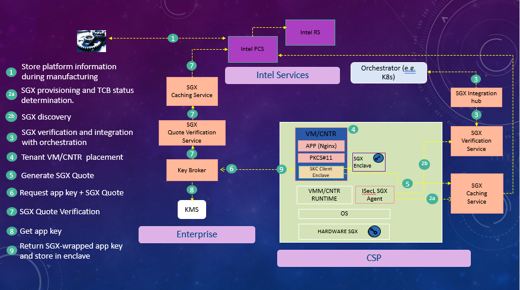
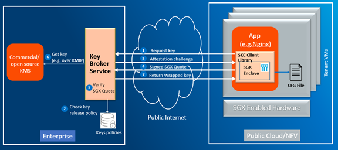

# SGX Attestation Infrastructure and SKC Components 

The components documented in this section are used by the SGX Attestation Infrastructure and therefore by SKC, which leverages the SGX Attestation Infrastructure. Components that are exclusively used by SKC have (SKC Only) in the corresponding sub-section title.

**Certificate Management Service**

All the certificates used by SKC services and by the SGX Agent are issued by the Certificate Management Service (CMS). CMS has a root CA certificate and all the SKC services and the SGX Agent certificates chain up to the CMS root CA.

CMS is an infrastructure service and is shared with other Intel® SecL-DC components.

**Authentication and Authorization Service**

The authentication and authorization for all SKC services and the SGX Agent are centrally managed by the Authentication and Authorization Service (AAS).

AAS is an infrastructure service and is shared with other Intel® SecL-DC components.

**SGX Caching Service**

The SGX Caching Service (SCS) allows to retrieve the PCK certificates of the data center server platforms from Intel SGX Provisioning Certification Service (PCS). SCS retrieves also platform models collateral. The collateral consists of the security patches (TCBInfo) that have been issued for Intel platform models. Finally, SCS retrieves the Certificate Revocation Lists (CRLs).

Since the Caching Service stores all the TCBInfo of all the platform models in the datacenter, the SGX Quote Verification Service (SQVS) uses it to determine the TCB status of the platforms in the data center.

The SKC Client retrieves its PCK certificate from the Caching Service when it generates an SGX quote.

SCS can be deployed in both Cloud Service Provider (CSP) and tenant environments. In the CSP environment, SCS is used to fetch PCK certificates for compute nodes in the data center. In the tenant environment, it's used to cache SGX collateral information used in verifying SGX quotes.

**SGX Host Verification Service**

If SGX Host Verification Service API URL is specified in SGX Agent env file, then SGX Agent will push the platform enablement info and TCB status to SHVS at regular interval, else, Agent pushes the platform enablement info and TCB status to SHVS periodically. The SGX enablement information consists of SGX discovery information (SGX supported, SGX enabled, FLC enabled and EPC memory size).

**SGX Agent**

The SGX Agent resides on physical servers and pushes SGX platform specific values to SGX Caching Service (SCS).

If SGX Host Verification Service (SHVS) URL is specified in SGX Agent env file, SGX Agent would fetch the TCB status from SCS and updates SHVS with platform enablement info and TCB status periodically.

**Integration Hub**

The Integration Hub (IHUB) allows to support SGX in Kubernetes and Open stack. IHUB pulls the list of hosts details from Kubernetes and then using the host information it pulls the SGX Data from SGX Host Verification Service and pushes it to Kubernetes. IHUB performs these steps on a regular basis so that the most recent SGX information about nodes is reflected in Kubernetes and Openstack. This integration allows Kubernetes and Openstack to schedule VMs and containers that need to run SGX workloads on compute nodes that support SGX. The SGX data that IHUB pushes to Kubernetes consists of SGX enabled/disabled, SGX supported/not supported, FLC enabled/not enabled, EPC memory size, TCB status up to date/not up to date and platform-data expiry time.

**Key Broker Service (SKC Only)**

The Key Broker Service (KBS) is typically deployed in the tenant environment, not the Cloud Service Provider (CSP) environment. KBS is effectively a policy compliance engine. Its job is to manage key transfer requests from SKC Clients, releasing keys only to those that meet policy requirements. A user admin can create and register keys in KBS. He can also create key policies and assign them to keys. A key policy specifies the conditions that the SKC Client must fulfill for keys that have the policy assigned to them to be released. Most of the information about an SKC Client is contained in the SGX quote that it sends to KBS. The SGX quote also contains a hash of the enclave's public key. KBS gets the public key along the quote so the hash in the quote allows to verify that the public key is genuine. If the SGX quote verification (attestation) is successful, KBS generates a Symmetric Wrapping Key (SWK), wraps it with the enclave public key and provisions it into the enclave, which can unwrap it since it has the corresponding private key. Application can then be provisioned into the SGX enclave after being wrapped with the SWK. Application keys are therefore never exposed to any software outside of the enclave. 

KBS is shared with other Intel® SecL-DC components.

**SGX Quote Verification Service**

The SGX Quote Verification Service (SQVS) is typically deployed in the tenant environment, not the Cloud Service Provider (CSP) environment. SQVS performs the verification of SGX quotes on behalf of KBS. SQVS determines if the SGX quote signature is valid. It also determines if the SGX quote has been generated on a platform that is up to date on security patches (TCB). For the latter, SQVS uses the SGX Caching Service, which caches the SGX collateral information about Intel platform models. SQVS also parses the SGX quote and extracts the entities and returns them to KBS, which can then make additional policy decisions based on the values of the theses entities.

**The Workload SGX Dependencies**

This is a set of dependencies needed by SGX workloads. 

**The SKC Client (Secure Key Caching Use case Only)**

The SKC Client refers to a suite of libraries that applications that require key protection must link with. It's comprised of the SKC Library, which is an Intel® SecL-DC component and the Intel Crypto Toolkit. the SKC Client uses the workload SGX dependencies component.  The SKC Library supports the PKCS\#11 interface and is therefore considered as a PKCS\#11 module from the host application perspective. The SKC Library uses Intel Crypto Toolkit to protect keys in an SGX enclave. When a key is requested by the host application, the SKC Library sends a request to the Key Broker Service (KBS) along with an SGX quote that is generated by the Crypto Toolkit. KBS releases the key after verifying the quote and evaluating the attributes contained in the quote. The key policy can also specify conditions that can't be verified with the SGX quote alone.

The SKC Client is typically deployed inside a tenant VM or container. It can also be used on bare metal. In all these deployments, the underlying platform is typically owned by a Cloud Service Provider (CSP) and is considered untrusted.

## Definitions, Acronyms, and Abbreviation

SKC -- Secure Key Caching

SGX -- Software Guard Extension

TEE -- Trusted Execution Environment

HSM -- Hardware Security Module

KBS -- Key Broker Service

CSP -- Cloud Service Provider

PCS -- Provisioning Certification Service

CRLs -- Certificate Revocation Lists 

AAS -- Authentication and Authorization Service

SWK -- Symmetric Wrapping Key

CRDs -- Custom Resource Definitions 

## Architecture Overview 

As indicated in the Features section, SKC provides 3 features essentially:

-   SGX Attestation Support: this is the feature that CSPs provide to tenants who need to run SGX workloads that require attestation.
-   SGX Support  in Orchestrators: this feature allows to discover SGX support in physical servers and related information:
    -   SGX supported.

    -   SGX enabled.

    -   Size of RAM reserved for SGX. It's called Enclave Page Cache (EPC).

    -   Flexible Launch Control enabled.
-   Key Protection: this is the feature used by tenants using a CSP to run workloads with key protection requirements.

The high-level architectures of these features are presented in the next sub-sections.

## SGX Attestation Support and SGX Support in Orchestrators

The diagram below shows the infrastructure that CSPs need to deploy to support SGX attestation and optionally, integration with orchestrators (Kubernetes and OpenStack). 

THE SGX Agent pushes platform information to SGX Caching Service (SCS), which uses it to get the PCK Certificate and other SGX collateral from the Intel SGX Provisioning Certification Service (PCS) and caches them locally. When a workload on the platform needs to generate an SGX Quote, it retrieves the PCK Certificate of the platform from SCS.

If SGX Host Verification Service (SHVS) URL is configured, the SGX Agent fetches the TCB Status from SCS and updates SHVS with SGX platform enablement information and TCB status periodically. The platform information is made available to Kubernetes and Openstack via the SGX Hub (IHUB), which pulls it from SHVS.

The SGX Quote Verification Service (SQVS) allows attesting applications to verify SGX quotes and extract the SGX quote attributes to verify compliance with a user-defined SGX enclave policy. SQVS uses the SGX Caching Service to retrieve SGX collateral needed to verify SGX quotes from the Intel SGX Provisioning Certification Service (PCS). SQVS typically runs in the attesting application owner network environment. Typically, a separate instance of the SGX Caching Service is setup in the attesting application owner network environment. 

The SGX Agent and the SGX services integrate with the Authentication and Authorization Service (AAS) and the Certificate Management Service (CMS). AAS and CMS are not represented on the diagram for clarity.

##  Key Protection

Key Protection leverages the SGX Attestation support and optionally, the SGX support in orchestrators.

Key Protection is implemented by the SKC Client -- a set of libraries - which must be linked with a tenant workload, like Nginx, deployed in a CSP environment and the Key Broker Service (KBS) deployed in the tenant's enterprise environment. The SKC Client retrieves the keys needed by the workload from KBS after proving that the key can be protected in an SGX enclave as shown in the diagram below.

Step 6 is optional (keys can be stored in KBS). Keys policies in step 2 are called Key Transfer Policies and are created by an Admin and assigned to Application keys.

##  SKC Virtualization (Supported only on RHEL 8.2, not supported on Ubuntu 18.04)

Virtualization enabled on SGX Host machines, uses SGX key features. With Virtualization being enabled on SGX host, SKC Library which uses Intel crypto tool kit to protect keys in SGX Enclave can be configured on Virtual Machines which are created on SGX Hosts. This enhancement further provides the privilege for a workload on a VM  allowing successful Secure Key transfer flow which meets the policy requirements. Hence virtualization on SGX Hosts supports key transfer flow for Workload on bare metal, Workload inside a VM, Workload in a container and Workload in a container inside a VM enabled on SGX Host.

