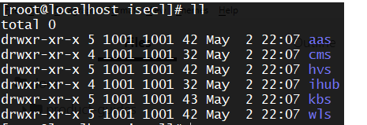

# Deployment 

## Pre-requisites

* Install `openssl` on K8s control-plane

* Ensure a docker registry is running locally or remotely. 

???+ note 
    For single node `microk8s` deployment, a registry can be brought up by using microk8s add-ons. More details present in Microk8s documentation. This is not mandatory, if a remote registry already exists, the same can be  used as well for single-node

???+ note 
    For multi-node `kubeadm` deployment, a docker registry needs to be setup by the user

* Push all container images to docker registry. Example below

  ```shell
  # Without TLS enabled
  skopeo copy oci-archive:<oci-image-tar-name> docker://<registry-ip/hostname>:<registry-port>/<image-name>:<image-tag> --dest-tls-verify=false
  
  # With TLS enabled
  skopeo copy oci-archive:<oci-image-tar-name> docker://<registry-ip/hostname>:<registry-port>/image-name>:<image-tag>
  ```

???+ note 
    In case of microk8s deployment, when docker registry is enabled locally, the OCI container images need to be copied to the node where registry is enabled and then the above example command can be run. The same would not be required when registry is remotely installed

* On each worker node with `TXT/BTG` enabled and registered to K8s control-plane, the following pre-req needs to be done on `RHEL-8.3`/`Ubuntu-18.04` systems

  * Foundational Security

    * `Tboot-1.10.1` or later to be installed for non `SUEFI` servers. [Tboot installation Details](https://github.com/intel-secl/docs/blob/master/product-guides/Foundational%20%26%20Workload%20Security.md#tboot-installation)

    * Only for `Ubuntu-18.04`, run the following commands

      ```shell
      $ modprobe msr
      ```

  * Workload Security
    * Container Confidentiality with CRIO runtime
      
      * `Tboot-1.10.1`  or later to be installed for non `SUEFI` servers. [Tboot installation Details](https://github.com/intel-secl/docs/blob/master/product-guides/Foundational%20%26%20Workload%20Security.md#tboot-installation) 
        
      * Copy `container-runtime` directory to each of the  physical servers  
      
      * Run the `install-prereqs-crio.sh` script on the physical servers from `container-runtime`
      
	???+ note 
		`container-runtime` scripts need to be run on `TXT/BTG/SUEFI` enabled services
      
      * Reboot the server
      
      * Only for `Ubuntu-18.04`, run the following command
      
          ```shell
          $ modprobe msr
          ```

## Deploy

### Single-Node

#### Pre-requisites

##### Setup

* `microk8s` being the default supported single node K8s distribution, users would need to install microk8s on a Physical server

* Copy all manifests and OCI container images as required to KK8s control-plane

* Ensure docker registry is running locally or remotely

* The K8s cluster admin should configure the existing bare metal worker nodes or register fresh bare metal worker nodes with labels. 
  For example, a label like `node.type: TXT-ENABLED` or `node.type: SUEFI-ENABLED` respectively for `TXT/SUEFI` enabled servers 
  can be used by the cluster admin to distinguish the baremetal worker node and the same label can be used in ISECL Agent pod configuration 
  to schedule on all worker nodes marked with the label. The same label is being used as default in the K8s manifests. 
  This can be edited in `k8s/manifests/ta/daemonset.yml` , `k8s/manifests/wla/daemonset.yml` 
  
  Refer Section in [appendix for Feature Detection](#hardware-feature-detection)
  - `node.type: TXT-ENABLED` should be labeled for nodes installed with tboot, where event logs will be collected from tboot measurements.
  - `node.type: SUEFI-ENABLED` should be labeled for nodes with SUEFI enabled, where event logs will be efi logs.
  
  ```shell
  #Label node for TXT
  kubectl label node <node-name> node.type=TXT-ENABLED
  
  #Label node for SUEFI
  kubectl label node <node-name> node.type=SUEFI-ENABLED
  ```
  
* In case of `microk8s` cluster, the `--allow-privileged=true` flag needs to be added to the `kube-apiserver` under `/var/snap/microk8s/current/args/kube-apiserver` and restart `kube-apiserver` with `systemctl restart snap.microk8s.daemon-apiserver` to allow running of privileged containers 
  like `TRUST-AGENT` and `WORKLOAD-AGENT`
  
* Ensure a backend KMIP-2.0 compliant server like pykmip is up and running.

##### Manifests

* Update all the K8s manifests with the image names to be pulled from the registry

* The `tolerations` and `node-affinity` in case of isecl-scheduler and isecl-controller needs to be updated in the respective manifests under the `manifests/k8s-extensions-controller`  and `manifests/k8s-extensions-scheduler` directories to `microk8s.io/cluster` based on k8s distributions of `kubeadm` and `microk8s` respectively

#### Deploy steps

The bootstrap script would facilitate the deployment of all FS,WS components at a use case level. Sample one given below.

##### Update `isecl-k8s.env` file


```shell
#Kubernetes Distribution - microk8s
K8S_DISTRIBUTION=microk8s
K8S_CONTROL_PLANE_IP=
K8S_CONTROL_PLANE_HOSTNAME=

# cms
CMS_BASE_URL=https://cms-svc.isecl.svc.cluster.local:8445/cms/v1
CMS_SAN_LIST=cms-svc.isecl.svc.cluster.local,<K8s control-plane IP/K8s control-plane Hostname>
CMS_K8S_ENDPOINT_URL=https://<k8s control-plane IP>:30445/cms/v1

# authservice
AAS_API_URL=https://aas-svc.isecl.svc.cluster.local:8444/aas/v1
AAS_API_CLUSTER_ENDPOINT_URL=https://<K8s control-plane IP>:30444/aas/v1
AAS_ADMIN_USERNAME=admin@aas
AAS_ADMIN_PASSWORD=aasAdminPass
AAS_DB_USERNAME=aasdbuser
AAS_DB_PASSWORD=aasdbpassword
AAS_DB_HOSTNAME=aasdb-svc.isecl.svc.cluster.local
AAS_DB_PORT="5432"
AAS_DB_NAME=aasdb
AAS_DB_SSLMODE=verify-full
AAS_SAN_LIST=aas-svc.isecl.svc.cluster.local,<K8s control-plane IP/K8s control-plane Hostname>
#NATS_ACCOUNT_NAME=ISecL-account

# Workload Service
WLS_SERVICE_USERNAME=admin@wls
WLS_SERVICE_PASSWORD=wlsAdminPass
WLS_DB_USERNAME=wlsdbuser
WLS_DB_PASSWORD=wlsdbpassword
WLS_DB_HOSTNAME=wlsdb-svc.isecl.svc.cluster.local
WLS_DB_NAME=wlsdb
WLS_DB_PORT="5432"
WLS_API_URL=https://wls-svc.isecl.svc.cluster.local:5000/wls/v1
WLS_CERT_SAN_LIST=wls-svc.isecl.svc.cluster.local

# Host Verification Service
HVS_SERVICE_USERNAME=admin@hvs
HVS_SERVICE_PASSWORD=hvsAdminPass
HVS_DB_USERNAME=hvsdbuser
HVS_DB_PASSWORD=hvsdbpassword
HVS_DB_HOSTNAME=hvsdb-svc.isecl.svc.cluster.local
HVS_DB_NAME=hvsdb
HVS_CERT_SAN_LIST=hvs-svc.isecl.svc.cluster.local,<K8s control-plane IP/K8s control-plane Hostname>
HVS_DB_PORT="5432"
HVS_URL=https://hvs-svc.isecl.svc.cluster.local:8443/hvs/v2/

#Nats Servers configuration for TA and HVS
#NATS_SERVERS=nats://<K8s control-plane IP/Hostname>:30222

# ihub bootstrap
IHUB_SERVICE_USERNAME=admin@hub
IHUB_SERVICE_PASSWORD=hubAdminPass
IH_CERT_SAN_LIST=ihub-svc.isecl.svc.cluster.local,<K8s control-plane IP/K8s control-plane Hostname>
# For microk8s
# K8S_API_SERVER_CERT=/var/snap/microk8s/current/certs/server.crt
K8S_API_SERVER_CERT=/var/snap/microk8s/current/certs/server.crt
# This is valid for multinode deployment, should be populated once ihub is deployed successfully
IHUB_PUB_KEY_PATH=
HVS_BASE_URL=https://hvs-svc.isecl.svc.cluster.local:8443/hvs/v2

# TrustAgent
# e.g TA_CERT_SAN_LIST=*.example.com,192.168.1.*
TA_CERT_SAN_LIST=
TPM_OWNER_SECRET=

# Workload Agent
WLA_SERVICE_USERNAME=wlauser@wls
WLA_SERVICE_PASSWORD=wlaAdminPass

# KBS
ENDPOINT_URL=https://kbs-svc.isecl.svc.cluster.local:9443/v1
KBS_CERT_SAN_LIST=kbs-svc.isecl.svc.cluster.local,<K8s control-plane IP>,<K8s control-plane Hostname>
KMIP_HOSTNAME=<KMIP IP/Hostname>
KMIP_SERVER_IP=
KMIP_SERVER_PORT=
# Retrieve the following KMIP server’s client certificate, client key and root ca certificate from the KMIP server.
# This key and certificates will be available in KMIP server, /etc/pykmip is the default path copy them to this system manifests/kbs/kmip-secrets path
KMIP_CLIENT_CERT_NAME=client_certificate.pem
KMIP_CLIENT_KEY_NAME=client_key.pem
KMIP_ROOT_CERT_NAME=root_certificate.pem

# ISecl Scheduler
# For microk8s
# K8S_CA_KEY=/var/snap/microk8s/current/certs/ca.key
# K8S_CA_CERT=/var/snap/microk8s/current/certs/ca.crt
K8S_CA_KEY=/var/snap/microk8s/current/certs/ca.key
K8S_CA_CERT=/var/snap/microk8s/current/certs/ca.crt

# populate users.env
ISECL_INSTALL_COMPONENTS="AAS,HVS,WLS,IHUB,KBS,WLA,TA,WPM"

#NATS_CERT_SAN_LIST=
#NATS_TLS_COMMON_NAME=

GLOBAL_ADMIN_USERNAME=
GLOBAL_ADMIN_PASSWORD=

INSTALL_ADMIN_USERNAME=
INSTALL_ADMIN_PASSWORD=

WPM_SERVICE_USERNAME=
WPM_SERVICE_PASSWORD=

CUSTOM_CLAIMS_COMPONENTS=
CCC_ADMIN_USERNAME=
CCC_ADMIN_PASSWORD=
```

???+ note 
    Ensure to update `KMIP_CLIENT_CERT_NAME`, `KMIP_CLIENT_KEY_NAME`, `KMIP_ROOT_CERT_NAME` in the env from `/etc/pykmip` of pykmip by copying the key and certs to this system under `manifests/kbs/kmip-secrets` path

##### Run scripts on K8s control-plane

* The bootstrap scripts are sample scripts to allow for a quick start of FS,WS services and agents. Users are free to modify the script or directly use the K8s manifests as per their deployment model requirements

```shell
#Pre-reqs.sh
./pre-requisites.sh

#isecl-bootstrap-db-services
#Reference
#Usage: ./isecl-bootstrap-db-services.sh [-help/up/purge]
#    -help          print help and exit
#    up        Bootstrap Database Services for Authservice, Workload Service and Host #verification Service
#    purge     Delete Database Services for Authservice, Workload Service and Host #verification Service

./isecl-bootstrap-db-services.sh up

#isecl-bootstrap
#Reference
#Usage: ./isecl-bootstrap.sh [-help/up/down/purge]
#    -help                                     Print help and exit
#    up   [all/<agent>/<service>/<usecase>]    Bootstrap ISecL K8s environment for #specified agent/service/usecase
#    down [all/<agent>/<service>/<usecase>]    Delete ISecL K8s environment for specified #agent/service/usecase [will not delete data, config, logs]
#    purge                                     Delete ISecL K8s environment with data, #config, logs [only supported for single node deployments]

#    Available Options for up/down command:
#        agent      Can be one of tagent, wlagent
#        service    Can be one of cms, authservice, hvs, ihub, wls, kbs, isecl-#controller, isecl-scheduler
#        usecase    Can be one of foundational-security, workload-security, isecl-#orchestration-k8s, csp, enterprise

./isecl-bootstrap.sh up <all/usecase of choice>
```

???+ note 
    An error to create asymmetric key would mean the following line, `RANDFILE = $ENV::HOME/.rnd` needs to be commented under `/etc/ssl/openssl.cnf`  

* Update the `IHUB_PUB_KEY_PATH` in `isecl-k8s.env` to `/etc/ihub/ihub_public_key.pem`
* Bring up isecl-scheduler

```shell
./isecl-bootstrap.sh up isecl-scheduler
```

* Copy `scheduler-policy.json`

```shell
mkdir -p /opt/isecl-k8s-extensions
cp manifests/k8s-extensions-scheduler/config/scheduler-policy.json /opt/isecl-k8s-extensions/
```

* Edit `kube-scheduler` and restart kubelet

```shell
#Edit the kube-scheduler
vi /var/snap/microk8s/current/args/kube-scheduler

#Add the below line
--policy-config-file=/opt/isecl-k8s-extensions/scheduler-policy.json

#Restart kubelet
systemctl restart snap.microk8s.daemon-kubelet.service
```

### Multi-Node

#### Pre-requisites

##### Setup

* `kubeadm` being the default supported multi-node K8s distribution, users would need to install a kubeadm K8s control-plane node setup

* Copy all manifests and OCI container images as required to K8s control-plane

* Ensure images are pushed to registry locally or remotely

* The K8s cluster admin should configure the existing bare metal worker nodes or register fresh bare metal worker nodes with labels. 
  For example, a label like `node.type: TXT-ENABLED` or `node.type: SUEFI-ENABLED` respectively for `TXT/SUEFI` enabled servers 
  can be used by the cluster admin to distinguish the baremetal worker node and the same label can be used in ISECL Agent pod configuration 
  to schedule on all worker nodes marked with the label. The same label is being used as default in the K8s manifests. 
  This can be edited in `k8s/manifests/ta/daemonset.yml` , `k8s/manifests/wla/daemonset.yml` 

  Refer Section in [appendix for Feature Detection](#hardware-feature-detection)
  - `node.type: TXT-ENABLED` should be used for nodes with tboot installed, where event logs will be collected from tboot measurements.
  - `node.type: SUEFI-ENABLED` should be used for nodes with SUEFI enabled, where event logs will be EFI logs.
    ```shell
    #Label node for TXT
    kubectl label node <node-name> node.type=TXT-ENABLED

    #Label node for SUEFI
    kubectl label node <node-name> node.type=SUEFI-ENABLED
    ```

* `NFS` storage class is used in kubernetes environment for data persistence and supported in ISecL FS/WS usecases. User needs to setup NFS server and create directory structure along with granting permission for a given user id. From security point of view, its been recommended to create a separate user id and grant the permission for all isecl directories for this user id. Below are some samples for reference

  * Snapshot showing directory structure for which user needs to create on NFS volumes manually or using custom scripts.

  

  * Snapshot showing ownership and permissions for directories for which user needs to manually grant the ownership.

  

  * Snapshot for configuring PV and PVC , user need to provide the NFS server IP or hostname and paths for each of the service directories. Sample manifest for creating `config-pv` for cms service

    ```yaml
    ---
    apiVersion: v1
    kind: PersistentVolume
    metadata:
        name: cms-config-pv
    spec:
        capacity:
        storage: 128Mi
        volumeMode: Filesystem
        accessModes:
        - ReadWriteMany
        persistentVolumeReclaimPolicy: Retain
        storageClassName: nfs
        nfs:
        path: /<NFS-vol-base-path>/isecl/cms/config
        server: <NFS Server IP/Hostname>
    ```

  * Sample manifest for creating config-pvc for cms service

    ```yaml
    ---
    apiVersion: v1
    kind: PersistentVolumeClaim
    metadata:
      name: cms-config-pvc
      namespace: isecl
    spec:
      storageClassName: nfs
      accessModes:
      - ReadWriteMany
      resources:
      requests:
          storage: 128Mi
    ```

???+ note 
    The user id specified in security context in `deployment.yml` for a given service and owner of the service related directories in NFS must be same
  
* Ensure a backend KMIP-2.0 compliant server like pykmip is up and running.

##### Manifests

* Update all the K8s manifests with the image names to be pulled from the registry

* The `tolerations` and `node-affinity` in case of isecl-scheduler and isecl-controller needs to be updated in the respective manifests under the `manifests/k8s-extensions-controller`  and `manifests/k8s-extensions-scheduler` directories to `node-role.kubernetes.io/master`
* All NFS PV yaml files needs to be updated with the  `path: /<NFS-vol-path>`  and `server: <NFS Server IP/Hostname>` under each service manifest file for `config`, `logs` , `db-data`

#### Deploy steps

##### Update `isecl-k8s.env` file

```shell
#Kubernetes Distribution - kubeadm
K8S_DISTRIBUTION=kubeadm
K8S_CONTROL_PLANE_IP=
K8S_CONTROL_PLANE_HOSTNAME=

# cms
CMS_BASE_URL=https://cms-svc.isecl.svc.cluster.local:8445/cms/v1
CMS_SAN_LIST=cms-svc.isecl.svc.cluster.local,<K8s control-plane IP/K8s control-plane Hostname>
CMS_K8S_ENDPOINT_URL=https://<k8s control-plane IP>:30445/cms/v1

# authservice
AAS_API_URL=https://aas-svc.isecl.svc.cluster.local:8444/aas/v1
AAS_API_CLUSTER_ENDPOINT_URL=https://<K8s control-plane IP>:30444/aas/v1
AAS_ADMIN_USERNAME=admin@aas
AAS_ADMIN_PASSWORD=aasAdminPass
AAS_DB_USERNAME=aasdbuser
AAS_DB_PASSWORD=aasdbpassword
AAS_DB_HOSTNAME=aasdb-svc.isecl.svc.cluster.local
AAS_DB_PORT="5432"
AAS_DB_NAME=aasdb
AAS_DB_SSLMODE=verify-full
AAS_SAN_LIST=aas-svc.isecl.svc.cluster.local,<K8s control-plane IP/K8s control-plane Hostname>
#NATS_ACCOUNT_NAME=ISecL-account

# Workload Service
WLS_SERVICE_USERNAME=admin@wls
WLS_SERVICE_PASSWORD=wlsAdminPass
WLS_DB_USERNAME=wlsdbuser
WLS_DB_PASSWORD=wlsdbpassword
WLS_DB_HOSTNAME=wlsdb-svc.isecl.svc.cluster.local
WLS_DB_NAME=wlsdb
WLS_DB_PORT="5432"
WLS_API_URL=https://wls-svc.isecl.svc.cluster.local:5000/wls/v1
WLS_CERT_SAN_LIST=wls-svc.isecl.svc.cluster.local

# Host Verification Service
HVS_SERVICE_USERNAME=admin@hvs
HVS_SERVICE_PASSWORD=hvsAdminPass
HVS_DB_USERNAME=hvsdbuser
HVS_DB_PASSWORD=hvsdbpassword
HVS_DB_HOSTNAME=hvsdb-svc.isecl.svc.cluster.local
HVS_DB_NAME=hvsdb
HVS_CERT_SAN_LIST=hvs-svc.isecl.svc.cluster.local,<K8s control-plane IP/K8s control-plane Hostname>
HVS_DB_PORT="5432"
HVS_URL=https://hvs-svc.isecl.svc.cluster.local:8443/hvs/v2/

#Nats Servers configuration for TA and HVS
#NATS_SERVERS=nats://<K8s control-plane IP/Hostname>:30222

# ihub bootstrap
IHUB_SERVICE_USERNAME=admin@hub
IHUB_SERVICE_PASSWORD=hubAdminPass
IH_CERT_SAN_LIST=ihub-svc.isecl.svc.cluster.local,<K8s control-plane IP/K8s control-plane Hostname>
# For Kubeadm
# K8S_API_SERVER_CERT=/etc/kubernetes/pki/apiserver.crt
K8S_API_SERVER_CERT=/etc/kubernetes/pki/apiserver.crt
# This is valid for multinode deployment, should be populated once ihub is deployed successfully
IHUB_PUB_KEY_PATH=
HVS_BASE_URL=https://hvs-svc.isecl.svc.cluster.local:8443/hvs/v2

# TrustAgent
# e.g TA_CERT_SAN_LIST=*.example.com,192.168.1.*
TA_CERT_SAN_LIST=
TPM_OWNER_SECRET=

# Workload Agent
WLA_SERVICE_USERNAME=wlauser@wls
WLA_SERVICE_PASSWORD=wlaAdminPass

# KBS
ENDPOINT_URL=https://kbs-svc.isecl.svc.cluster.local:9443/v1
KBS_CERT_SAN_LIST=kbs-svc.isecl.svc.cluster.local,<K8s control-plane IP>,<K8s control-plane Hostname>
KMIP_HOSTNAME=<KMIP IP/Hostname>
KMIP_SERVER_IP=
KMIP_SERVER_PORT=
# Retrieve the following KMIP server’s client certificate, client key and root ca certificate from the KMIP server.
# This key and certificates will be available in KMIP server, /etc/pykmip is the default path copy them to this system manifests/kbs/kmip-secrets path
KMIP_CLIENT_CERT_NAME=client_certificate.pem
KMIP_CLIENT_KEY_NAME=client_key.pem
KMIP_ROOT_CERT_NAME=root_certificate.pem

# ISecl Scheduler
# For Kubeadm
# K8S_CA_KEY=/etc/kubernetes/pki/ca.key
# K8S_CA_CERT=/etc/kubernetes/pki/ca.crt
K8S_CA_KEY=/etc/kubernetes/pki/ca.key
K8S_CA_CERT=/etc/kubernetes/pki/ca.crt

# populate users.env
ISECL_INSTALL_COMPONENTS="AAS,HVS,WLS,IHUB,KBS,WLA,TA,WPM"

#NATS_CERT_SAN_LIST=
#NATS_TLS_COMMON_NAME=

GLOBAL_ADMIN_USERNAME=
GLOBAL_ADMIN_PASSWORD=

INSTALL_ADMIN_USERNAME=
INSTALL_ADMIN_PASSWORD=

WPM_SERVICE_USERNAME=
WPM_SERVICE_PASSWORD=

CUSTOM_CLAIMS_COMPONENTS=
CCC_ADMIN_USERNAME=
CCC_ADMIN_PASSWORD=
```

???+ note 
    Ensure to update `KMIP_CLIENT_CERT_NAME`, `KMIP_CLIENT_KEY_NAME`, `KMIP_ROOT_CERT_NAME` in the env from `/etc/pykmip` of pykmip by copying the key and certs to this system under `manifests/kbs/kmip-secrets` path

##### Run scripts on K8s control-plane

* The bootstrap scripts are sample scripts to allow for a quick start of FS,WS services and agents. Users are free to modify the script or directly use the K8s manifests as per their deployment model requirements

```shell
#Pre-reqs.sh
./pre-requisites.sh

#isecl-bootstrap-db-services
#Reference
#Usage: ./isecl-bootstrap-db-services.sh [-help/up/purge]
#    -help          print help and exit
#    up        Bootstrap Database Services for Authservice, Workload Service and Host verification Service
#    purge     Delete Database Services for Authservice, Workload Service and Host verification Service

./isecl-bootstrap-db-services.sh up

#isecl-bootstrap
#Reference
#Usage: ./isecl-bootstrap.sh [-help/up/down/purge]
#    -help                                     Print help and exit
#    up   [all/<agent>/<service>/<usecase>]    Bootstrap ISecL K8s environment for #specified agent/service/usecase
#    down [all/<agent>/<service>/<usecase>]    Delete ISecL K8s environment for specified #agent/service/usecase [will not delete data, config, logs]
#    purge                                     Delete ISecL K8s environment with data, config, logs [only supported for single node deployments]

#    Available Options for up/down command:
#        agent      Can be one of tagent, wlagent
#        service    Can be one of cms, authservice, hvs, ihub, wls, kbs, isecl-#controller, isecl-scheduler
#        usecase    Can be one of foundational-security, workload-security, isecl-#orchestration-k8s, csp, enterprise

./isecl-bootstrap.sh up <all/usecase of choice>
```

???+ note 
    An error to create asymmetric key would mean the following line, `RANDFILE = $ENV::HOME/.rnd` needs to be commented under `/etc/ssl/openssl.cnf`  


* Copy the `ihub_public_key.pem` from NFS path -`<mnt>/isecl/ihub/config/ihub_public_key.pem ` to K8s control-plane
* Update the `isecl-k8s.env` for `IHUB_PUB_KEY_PATH`
* Bring up the `isecl-k8s-scheduler`

```shell
./isecl-bootstrap.sh up isecl-scheduler
```


* Create and update `scheduler-policy.json` path

```shell
mkdir -p /opt/isecl-k8s-extensions
cp manifests/k8s-extensions-scheduler/config/scheduler-policy.json /opt/isecl-k8s-extensions
```

* Configure kube-scheduler to establish communication with isecl-scheduler. Add `scheduler-policy.json` under kube-scheduler section, `mountPath` under container section and `hostPath` under volumes section in ` /etc/kubernetes/manifests/kube-scheduler.yaml` as mentioned below

```yaml
spec:
  containers:
  - command:
    - kube-scheduler
    - --policy-config-file=/opt/isecl-k8s-extensions/scheduler-policy.json
```

```yaml
containers:
    volumeMounts:
    - mountPath: /opt/isecl-k8s-extensions/
      name: extendedsched
      readOnly: true
```

```yaml
volumes:
  - hostPath:
      path: /opt/isecl-k8s-extensions/
      type:
    name: extendedsched
```

???+ note 
    Make sure to use proper indentation and don't delete existing `mountPath` and `hostPath` sections in `kube-scheduler.yaml`

* Restart `kubelet` which restart all the k8s services including kube-scheduler

```shell
systemctl restart kubelet
```
