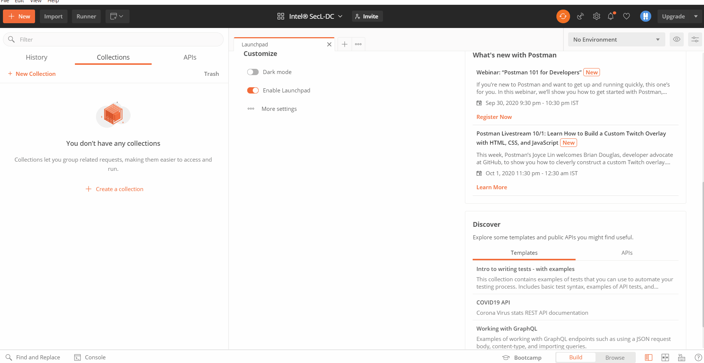
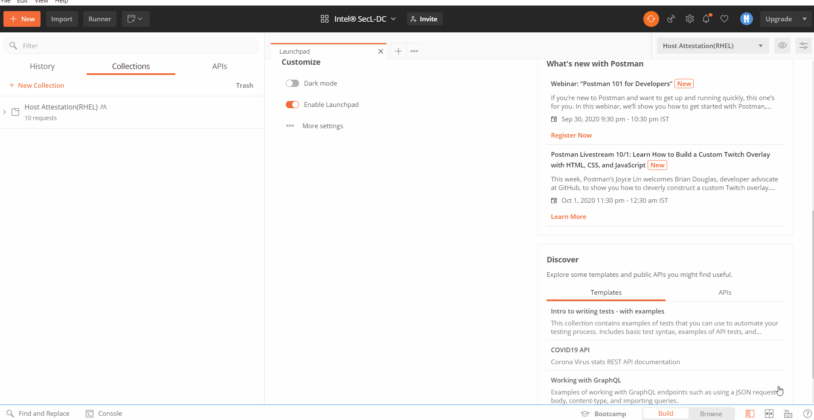
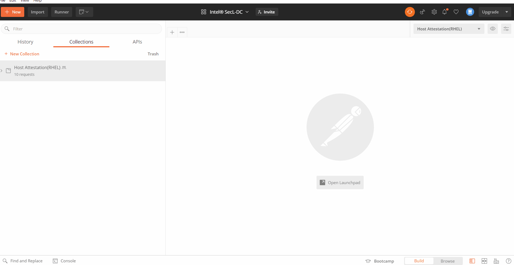

# Usecase Workflows API Collections 

The below allow to get started with workflows within Intel® SecL-DC for Foundational and Workload Security Usecases. More details available in [API Collections](https://github.com/intel-secl/utils/tree/v3.6/develop/tools/api-collections) repository

## Pre-requisites

* Postman client should be [downloaded](https://www.postman.com/downloads/) on supported platforms or on the web to get started with the usecase collections.

???+ note 
    The Postman API Network will always have the latest released version of the API Collections. For all releases, refer the github repository for [API Collections](https://github.com/intel-secl/utils/tree/v3.6/develop/tools/api-collections)

## Use Case Collections

| Use case               | Sub-Usecase                                   | API Collection     |
| ---------------------- | --------------------------------------------- | ------------------ |
| Foundational Security  | Host Attestation(RHEL & VMWARE)                              | ✔️                  |
|                        | Data Fencing  with Asset Tags(RHEL & VMWARE)                 | ✔️                  |
|                        | Trusted Workload Placement (Containers)  | ✔️ |
| Workload Security | Container Confidentiality with Docker Runtime | ✔️                  |
|                        | Container Confidentiality with CRIO Runtime   | ✔️                  |

## Downloading API Collections

* Postman API Network for latest released: https://explore.postman.com/intelsecldc

  or 

* Github repo for all releases

  ```shell
  #Clone the github repo for api-collections
  git clone https://github.com/intel-secl/utils.git
  
  #Switch to specific release-version of choice
  cd utils/
  git checkout <release-version of choice>
  
  #Import Collections from
  cd tools/api-collections
  ```

???+ note 
    The postman-collections are also available when cloning the repos via build manifest under `utils/tools/api-collections`

## Running API Collections

* Import the collection into Postman API Client

???+ note 
    This step is required only when not using Postman API Network and downloading from Github

  

* Update env as per the deployment details for specific usecase

  

* View Documentation

  

* Run the workflow

  
