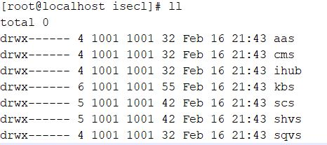

# Deployment 

## Pre-requisites

* Install `openssl` on K8s control-plane
???+ note 
    For Ubuntu OS, comment `RANDFILE = $ENV::HOME/.rnd` line in /etc/ssl/openssl.cnf

* Ensure a docker registry is running locally or remotely. 

???+ note 
    For single node `microk8s` deployment, a registry can be brought up by using microk8s add-ons. More details present in Microk8s documentation. This is not mandatory, if a remote registry already exists, the same can be  used as well for single-node

???+ note 
    For multi-node `kubeadm` deployment, a docker registry needs to be setup by the user

* Push all container images to docker registry. Example below

  ```shell
  # Without TLS enabled
  skopeo copy oci-archive:<oci-image-tar-name> docker://<registry-ip/hostname>:<registry-port>/<image-name>:<image-tag> --dest-tls-verify=false
  
  # With TLS enabled
  skopeo copy oci-archive:<oci-image-tar-name> docker://<registry-ip/hostname>:<registry-port>/image-name>:<image-tag>
  ```

???+ note 
    In case of microk8s deployment, when docker registry is enabled locally, the OCI container images need to be copied to the node where registry is enabled and then the above example command can be run. The same would not be required when registry is remotely installed

* On each worker node with SGX enabled and registered to K8s control-plane, the following pre-req needs to be done

  * `RHEL 8.2` enabled K8s worker node with SGX:
    * Pre requisite scripts will be available under `k8s/platform-dependencies/` on build machine
    * Copy the platform-dependencies script to SGX enabled worker nodes on K8s
    * Execute  `./agent_untar.sh`  
    * Execute `./agent_container_prereq.sh` for deploying all pre-reqs required for agent
    
  * `Ubuntu 18.04` enabled K8s worker node with SGX:
    * Pre requisite scripts will be available under `k8s/platform-dependencies/` on build machine
    * Copy the platform-dependencies script to SGX enabled worker nodes
    * Execute  `./agent_untar.sh`  
    * Execute `./agent_container_prereq.sh` for deploying all pre-reqs required for agent


* Ensure a backend KMIP-2.0 compliant server like pykmip is up and running.
    * Retrieve KMIP server's key and certificates i.e. client_certificate.pem, client_key.pem and root_certificate.pem files from /etc/pykmip (default path) to K8s control-plane node under `k8s/manifests/kbs/kmip-secrets/` path.
???+ note 
    Under `k8s/manifests/kbs/` , if kmip-secrets folder not available then please create it before copying above key and certs 

* Ensure that system date and time are in sync across all servers (K8s control-plane node, worker node, nfs server, kmip server)

## Deploy

### Single-Node

#### Pre-requisites 

##### Setup

* `microk8s` being the default supported single node K8s distribution, users would need to install microk8s on a Physical server

* Copy all manifests and OCI container images as required to K8s control-plane

* Ensure docker registry is running locally or remotely

* The K8s cluster admin configure the existing bare metal worker nodes or register fresh bare metal worker nodes with labels. For example, a label like `node.type: SGX-ENABLED` can be used by the cluster admin to distinguish the baremetal worker node and the same label can be used in ISECL Agent pod configuration to schedule on all worker nodes marked with the label. The same label is being used as default in the K8s manifests. This can be edited in `k8s/manifests/sgx_agent/daemonset.yml` , `k8s/manifests/skc_library/deployment.yml`
  ```shell
  #Label node
  kubectl label node <node-name> node.type=SGX-ENABLED
  ```
  
* In case of `microk8s` cluster, the `--allow-privileged=true` flag needs to be added to the `kube-apiserver` under `/var/snap/microk8s/current/args/kube-apiserver` and restart `kube-apiserver` with `systemctl restart snap.microk8s.daemon-apiserver` to allow running of privileged containers 
  like `SGX-AGENT` and `SKC-LIBRARY`
  
* Enable external API communication for `microk8s` to talk to external Intel PCS server

  ```shell
  kubectl get configmap -n kube-system
  kubectl edit configmap -n kube-system coredns
  #edit coredns config map and change the name server as:
  "forward . /etc/resolv.conf"
  #Delete coredns pod, it will relaunch
  ```

##### Manifests

* Update all the K8s manifests with the image names to be pulled from the registry

* The key field in `tolerations` and `nodeAffinity` in case of isecl-scheduler and isecl-controller needs to be updated in the respective manifests under the `manifests/k8s-extensions-controller`  and `manifests/k8s-extensions-scheduler` directories to `microk8s.io/cluster` based on k8s distributions of `kubeadm` and `microk8s` respectively
#### Deploy steps

The bootstrap script would facilitate the deployment of all SGX components at a usecase level. Sample one given below.

##### Update .env file

```shell
#Kubernetes Distribution microk8s or kubeadm
K8S_DISTRIBUTION=microk8s
K8S_CONTROL_PLANE_IP=<K8s control-plane IP>
K8S_CONTROL_PLANE_HOSTNAME=<K8s control-plane Hostname>

# cms
CMS_SAN_LIST=cms-svc.isecl.svc.cluster.local,<K8s control-plane IP>,<K8s control-plane Hostname>

# authservice
AAS_API_CLUSTER_ENDPOINT_URL=https://<K8s control-plane IP>>:30444/aas/v1
AAS_ADMIN_USERNAME=admin@aas
AAS_ADMIN_PASSWORD=aasAdminPass
AAS_DB_USERNAME=aasdbuser
AAS_DB_PASSWORD=aasdbpassword
AAS_SAN_LIST=aas-svc.isecl.svc.cluster.local,<K8s control-plane IP>,<K8s control-plane Hostname>

# SGX Caching Service
SCS_ADMIN_USERNAME=scsuser@scs
SCS_ADMIN_PASSWORD=scspassword
SCS_DB_USERNAME=scsdbuser
SCS_DB_PASSWORD=scsdbpassword
# To be generated by user via Intel PCS server in case of new users, else the exisiting Provisioning key can be used
INTEL_PROVISIONING_SERVER_API_KEY=<provisioning server key>
SCS_CERT_SAN_LIST=scs-svc.isecl.svc.cluster.local,<K8s control-plane IP>,<K8s control-plane Hostname>

# SGX host verification service
SHVS_ADMIN_USERNAME=shvsuser@shvs
SHVS_ADMIN_PASSWORD=shvspassword
SHVS_DB_USERNAME=shvsdbuser
SHVS_DB_PASSWORD=shvsdbpassword
SHVS_CERT_SAN_LIST=shvs-svc.isecl.svc.cluster.local,<K8s control-plane IP>,<K8s control-plane Hostname>

# ihub bootstrap
IHUB_SERVICE_USERNAME=admin@hub
IHUB_SERVICE_PASSWORD=hubAdminPass
IH_CERT_SAN_LIST=ihub-svc.isecl.svc.cluster.local,<K8s control-plane IP>
# For microk8s
# K8S_API_SERVER_CERT=/var/snap/microk8s/current/certs/server.crt
K8S_API_SERVER_CERT=/var/snap/microk8s/current/certs/server.crt
IHUB_PUB_KEY_PATH=/etc/ihub/ihub_public_key.pem

# KBS bootstrap credentials
KBS_SERVICE_USERNAME=admin@kbs
KBS_SERVICE_PASSWORD=kbsAdminPass
# For SKC Virtualization use case set ENDPOINT_URL=https://<K8s control-plane IP>>:30448/v1
ENDPOINT_URL=https://kbs-svc.isecl.svc.cluster.local:9443/v1
KBS_CERT_SAN_LIST=kbs-svc.isecl.svc.cluster.local,<K8s control-plane IP>,<K8s control-plane Hostname>

KMIP_SERVER_IP=<KMIP Server IP>
KMIP_SERVER_PORT=<KMIP Server Port>
KMIP_HOSTNAME=<KMIP IP/Hostname>
#Provide either FQDN or KMIP SERVER IP for kmip hostname
#Default port for kmip server is 5696

# ISecl Scheduler
# For microk8s
# K8S_CA_KEY=/var/snap/microk8s/current/certs/ca.key
# K8S_CA_CERT=/var/snap/microk8s/current/certs/ca.crt
K8S_CA_KEY=/var/snap/microk8s/current/certs/ca.key
K8S_CA_CERT=/var/snap/microk8s/current/certs/ca.crt

#Skc Library
#Comment during fresh deploy,Uncomment this and update key id when deploying SKC Library
#KBS_PUBLIC_CERTIFICATE=<key id>.crt

SCS_SERVICE_USERNAME=scsuser@scs
SCS_SERVICE_PASSWORD=scspassword

SHVS_SERVICE_USERNAME=shvsuser@shvs
SHVS_SERVICE_PASSWORD=shvspassword

SQVS_SERVICE_USERNAME=sqvsuser@sqvs
SQVS_SERVICE_PASSWORD=sqvspassword

CCC_ADMIN_USERNAME=ccc_admin
CCC_ADMIN_PASSWORD=password

GLOBAL_ADMIN_USERNAME=global_admin_user
GLOBAL_ADMIN_PASSWORD=globalAdminPass

INSTALL_ADMIN_USERNAME=superadmin
INSTALL_ADMIN_PASSWORD=superAdminPass
```

##### Run scripts on K8s control-plane

* The bootstrap scripts are sample scripts to allow for a quick start of SKC services and agents. Users are free to modify the script or directly use the K8s manifests as per their deployment model requirements

```shell
#Pre-reqs.sh
./pre-requisites.sh

#skc-bootstrap-db-services
#Reference
#Usage: ./skc-bootstrap-db-services.sh [-help/up/purge]
#    -help     print help and exit
#    up        Bootstrap Database Services for Authservice, SGX Caching Service and SGX Host verification Service
#    purge     Delete Database Services for Authservice, SGX Caching Service and SGX Host verification Service
./skc-bootstrap-db-services.sh up

#skc-bootstrap
#Reference
#Usage: ./skc-bootstrap.sh [-help/up/down/purge]
#    -help                                     Print help and exit
#    up   [all/<agent>/<service>/<usecase>]    Bootstrap SKC K8s environment for specified agent/service/usecase
#    down [all/<agent>/<service>/<usecase>]    Delete SKC K8s environment for specified agent/service/usecase [will not delete data,config,logs]
#    purge                                     Delete SKC K8s environment with data,config,logs [only supported for single node deployments]

#    Available Options for up/down command:
#        agent      Can be one of sagent,skclib
#        service    Can be one of cms,authservice,scs,shvs,ihub,sqvs,kbs,isecl-controller,isecl-scheduler
#        usecase    Can be one of secure-key-caching,sgx-attestation,sgx-orchestration-k8s,sgx-virtualization,csp,enterprise
./skc-bootstrap.sh up <all/usecase of choice>
```


* Create and update `scheduler-policy.json` path

```shell
mkdir -p /opt/isecl-k8s-extensions
cp manifests/k8s-extensions-scheduler/config/scheduler-policy.json /opt/isecl-k8s-extensions
```


* Configure kube-scheduler to establish communication with isecl-scheduler.

```shell
vi /var/snap/microk8s/current/args/kube-scheduler

#Add the below line
--policy-config-file=/opt/isecl-k8s-extensions/scheduler-policy.json

#Restart kubelet
systemctl restart snap.microk8s.daemon-kubelet.service
```


### Multi-Node

#### Pre-requisites

##### Setup

* `kubeadm` being the default supported multi-node K8s distribution, users would need to install a kubeadm K8s control-plane node setup

* Copy all manifests and OCI container images as required to K8s control-plane

* Ensure images are pushed to registry locally or remotely

* The K8s cluster admin configure the existing bare metal worker nodes or register fresh bare metal worker nodes with labels. For example, a label like `node.type: SGX-ENABLED` can be used by the cluster admin to distinguish the baremetal worker node and the same label can be used in ISECL Agent pod configuration to schedule on all worker nodes marked with the label. The same label is being used as default in the K8s manifests. This can be edited in `k8s/manifests/sgx_agent/daemonset.yml` , `k8s/manifests/skc_library/deployment.yml`
  ```shell
  #Label node
  kubectl label node <node-name> node.type=SGX-ENABLED
  ```

* `NFS` storage class is used in kubernetes environment for data persistence and supported in SKC. User needs to setup NFS server and create directory structure along with granting permission for a given user id. From security point of view, its been recommended to create a separate user id and grant the permission for all isecl directories for this user id. Below are some samples for reference

  * Snapshot showing directory structure for which user needs to create on NFS volumes manually or using custom scripts.

  

  * Snapshot showing ownership and permissions for directories for which user needs to manually grant the ownership.

  

  * Snapshot for configuring PV and PVC , user need to provide the NFS server IP or hostname and paths for each of the service directories. Sample manifest for creating `config-pv` for cms service

  ```
  ---
  apiVersion: v1
  kind: PersistentVolume
  metadata:
    name: cms-config-pv
  spec:
    capacity:
      storage: 128Mi
    volumeMode: Filesystem
    accessModes:
      - ReadWriteMany
    persistentVolumeReclaimPolicy: Retain
    storageClassName: nfs
    nfs:
      path: /<NFS-vol-base-path>/isecl/cms/config
      server: <NFS Server IP/Hostname>
  ```

  Sample manifest for creating config-pvc for cms service

  ```
  ---
  apiVersion: v1
  kind: PersistentVolumeClaim
  metadata:
    name: cms-config-pvc
    namespace: isecl
  spec:
    storageClassName: nfs
    accessModes:
      - ReadWriteMany
    resources:
      requests:
        storage: 128Mi
  ```

???+ note 
    The user id specified in security context in `deployment.yml` for a given service and owner of the service related directories in NFS must be same

##### Manifests

* Update all the K8s manifests with the image names to be pulled from the registry

* The key field in `tolerations` and `nodeAffinity` in case of isecl-scheduler and isecl-controller needs to be updated in the respective manifests under the `manifests/k8s-extensions-controller`  and `manifests/k8s-extensions-scheduler` directories to `node-role.kubernetes.io/master`
* All NFS PV yaml files needs to be updated with the  `path: /<NFS-vol-path>`  and `server: <NFS Server IP/Hostname>` under each service manifest file for `config`, `logs` , `db-data`

#### Deploy steps

##### Update .env file

```shell
#Kubernetes Distribution microk8s or kubeadm
K8S_DISTRIBUTION=kubeadm
K8S_CONTROL_PLANE_IP=<K8s control-plane IP>
K8S_CONTROL_PLANE_HOSTNAME=<K8s control-plane Hostname>

# cms
CMS_SAN_LIST=cms-svc.isecl.svc.cluster.local,<K8s control-plane IP>,<K8s control-plane Hostname>

# authservice
AAS_API_CLUSTER_ENDPOINT_URL=https://<K8s control-plane IP>:30444/aas/v1
AAS_ADMIN_USERNAME=admin@aas
AAS_ADMIN_PASSWORD=aasAdminPass
AAS_DB_USERNAME=aasdbuser
AAS_DB_PASSWORD=aasdbpassword
AAS_SAN_LIST=aas-svc.isecl.svc.cluster.local,<K8s control-plane IP>,<K8s control-plane Hostname>

# SGX Caching Service
SCS_ADMIN_USERNAME=scsuser@scs
SCS_ADMIN_PASSWORD=scspassword
SCS_DB_USERNAME=scsdbuser
SCS_DB_PASSWORD=scsdbpassword
# To be generated by user via Intel PCS server in case of new users, else the exisiting Provisioning key can be used
INTEL_PROVISIONING_SERVER_API_KEY=<provisioning server key>
SCS_CERT_SAN_LIST=scs-svc.isecl.svc.cluster.local,<K8s control-plane IP>,<K8s control-plane Hostname>

# SGX host verification service
SHVS_ADMIN_USERNAME=shvsuser@shvs
SHVS_ADMIN_PASSWORD=shvspassword
SHVS_DB_USERNAME=shvsdbuser
SHVS_DB_PASSWORD=shvsdbpassword
SHVS_CERT_SAN_LIST=shvs-svc.isecl.svc.cluster.local,<K8s control-plane IP>,<K8s control-plane Hostname>

# ihub bootstrap
IHUB_SERVICE_USERNAME=admin@hub
IHUB_SERVICE_PASSWORD=hubAdminPass
IH_CERT_SAN_LIST=ihub-svc.isecl.svc.cluster.local,<K8s control-plane IP>,<K8s control-plane Hostname>
# For Kubeadm
# K8S_API_SERVER_CERT=/etc/kubernetes/pki/apiserver.crt
K8S_API_SERVER_CERT=/etc/kubernetes/pki/apiserver.crt
# This is not valid for multinode deployment, should be populated once ihub is deployed successfully
IHUB_PUB_KEY_PATH=<skip this during initial deploy of K8s multi-node>

# KBS bootstrap credentials
KBS_SERVICE_USERNAME=admin@kbs
KBS_SERVICE_PASSWORD=kbsAdminPass
# For SKC Virtualization use case set ENDPOINT_URL=https://<K8s control-plane IP>:30448/v1
ENDPOINT_URL=https://kbs-svc.isecl.svc.cluster.local:9443/v1
KBS_CERT_SAN_LIST=kbs-svc.isecl.svc.cluster.local,<K8s control-plane IP>,<K8s control-plane Hostname>

KMIP_SERVER_IP=<KMIP Server IP>
KMIP_SERVER_PORT=<KMIP Server Port>
KMIP_HOSTNAME=<KMIP IP/Hostname>
#Provide either FQDN or KMIP SERVER IP for kmip hostname
#Default port for kmip server is 5696


# ISecl Scheduler
# For Kubeadm
# K8S_CA_KEY=/etc/kubernetes/pki/ca.key
# K8S_CA_CERT=/etc/kubernetes/pki/ca.crt
K8S_CA_KEY=/etc/kubernetes/pki/ca.key
K8S_CA_CERT=/etc/kubernetes/pki/ca.crt

#Skc Library
#Comment during fresh deploy,Uncomment this and update key id when deploying SKC Library
#KBS_PUBLIC_CERTIFICATE=<key id>.crt

SCS_SERVICE_USERNAME=scsuser@scs
SCS_SERVICE_PASSWORD=scspassword

SHVS_SERVICE_USERNAME=shvsuser@shvs
SHVS_SERVICE_PASSWORD=shvspassword

SQVS_SERVICE_USERNAME=sqvsuser@sqvs
SQVS_SERVICE_PASSWORD=sqvspassword

CCC_ADMIN_USERNAME=ccc_admin
CCC_ADMIN_PASSWORD=password

GLOBAL_ADMIN_USERNAME=global_admin_user
GLOBAL_ADMIN_PASSWORD=globalAdminPass

INSTALL_ADMIN_USERNAME=superadmin
INSTALL_ADMIN_PASSWORD=superAdminPass

```

##### Run scripts on K8s control-plane

* The bootstrap scripts are sample scripts to allow for a quick start of SKC services and agents. Users are free to modify the script or directly use the K8s manifests as per their deployment model requirements

```shell
#If using sample script provided for creating nfs directories
#Copy the script to the base path of the NFS location configured
chmod +x create-skc-dirs.nfs.sh
./create-skc-dirs.nfs.sh

#Pre-reqs.sh
./pre-requisites.sh

#skc-bootstrap-db-services
#Reference
#Usage: ./skc-bootstrap-db-services.sh [-help/up/purge]
#    -help     print help and exit
#    up        Bootstrap Database Services for Authservice, SGX Caching Service and SGX Host verification Service
#    purge     Delete Database Services for Authservice, SGX Caching Service and SGX Host verification Service
./skc-bootstrap-db-services.sh up

#skc-bootstrap
#Reference
#Usage: ./skc-bootstrap.sh [-help/up/down/purge]
#    -help                                     Print help and exit
#    up   [all/<agent>/<service>/<usecase>]    Bootstrap SKC K8s environment for specified agent/service/usecase
#    down [all/<agent>/<service>/<usecase>]    Delete SKC K8s environment for specified agent/service/usecase [will not delete data,config,logs]
#    purge                                     Delete SKC K8s environment with data,config,logs [only supported for single node deployments]

#    Available Options for up/down command:
#        agent      Can be one of sagent,skclib
#        service    Can be one of cms,authservice,scs,shvs,ihub,sqvs,kbs,isecl-controller,isecl-scheduler
#        usecase    Can be one of secure-key-caching,sgx-attestation,sgx-orchestration-k8s,sgx-virtualization,csp,enterprise
./skc-bootstrap.sh up <all/usecase of choice>

#NOTE: The isecl-scheduler will not be deployed in case of multi-node K8s as there is dependency on the NFS server IHUB public key to be copied from NFS to K8s control-plane to allow the successful installation of isecl-scheduler. Post update of the isecl-k8s-skc.env for IHUB_PUB_KEY_PATH on K8s control-plane, user needs to run the following
./skc-bootstrap.sh up isecl-scheduler
```

* Create and update `scheduler-policy.json` path

```shell
mkdir -p /opt/isecl-k8s-extensions
cp manifests/k8s-extensions-scheduler/config/scheduler-policy.json /opt/isecl-k8s-extensions
```

* Configure kube-scheduler to establish communication with isecl-scheduler. Add `scheduler-policy.json` under kube-scheduler section, `mountPath` under container section and `hostPath` under volumes section in` /etc/kubernetes/manifests/kube-scheduler.yaml` as mentioned below

```yaml
spec:
  containers:
  - command:
    - kube-scheduler
    - --policy-config-file=/opt/isecl-k8s-extensions/scheduler-policy.json
```

```yaml
containers:
    volumeMounts:
    - mountPath: /opt/isecl-k8s-extensions/
      name: extendedsched
      readOnly: true
```

```yaml
volumes:
  - hostPath:
      path: /opt/isecl-k8s-extensions/
      type:
    name: extendedsched
```

???+ note 
    Make sure to use proper indentation and don't delete existing `mountPath` and `hostPath` sections in `kube-scheduler.yaml`

* Restart `kubelet` which restart all the k8s services including kube-scheduler

```shell
systemctl restart kubelet
```
